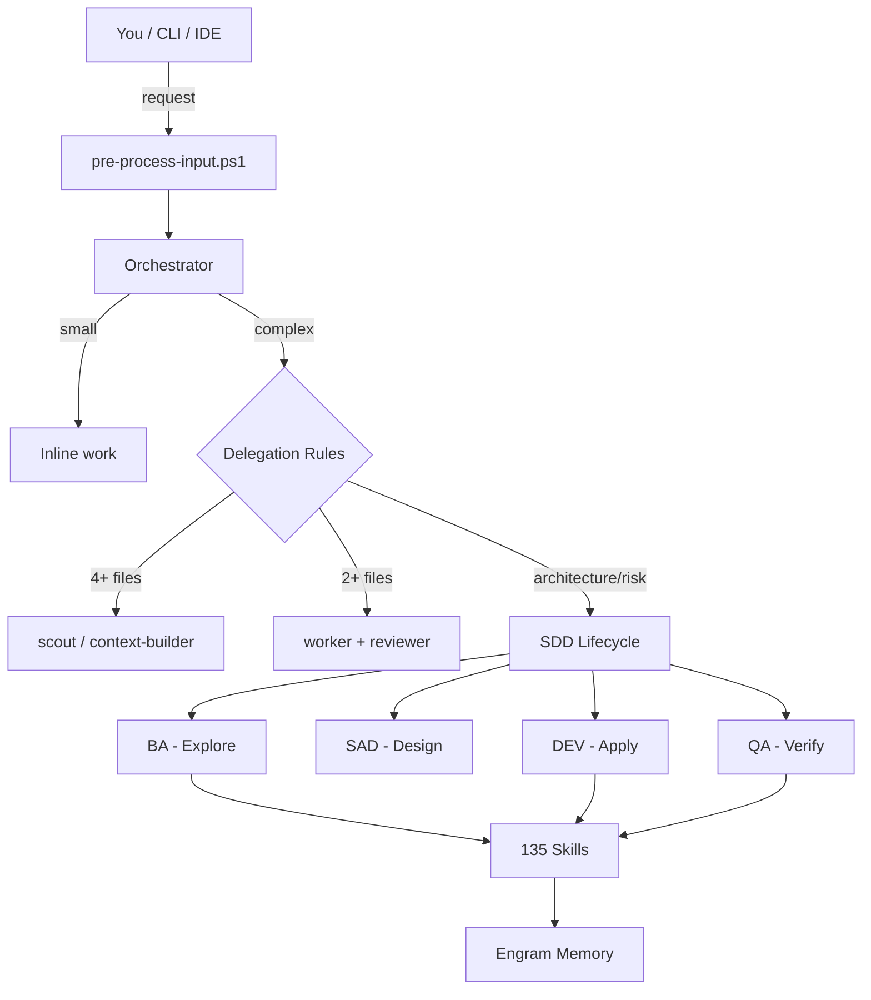

<p align="center">
  
</p>

<p align="center">
  
  
  
  
  
  
  
  
</p>

<p align="center">
  <a href="https://github.com/EmmanuelOrtiz87/gentle-vanguard-public">GitHub</a>
  &nbsp;·&nbsp;
  <a href="docs/">Documentation</a>
  &nbsp;·&nbsp;
  <a href="../../releases">Releases</a>
  &nbsp;·&nbsp;
  <a href="SECURITY.md">Security</a>
</p>

<p align="center">
  <strong>AI-powered development orchestrator · 18 agents · 135 skills · 10 tool-compatible</strong><br>
  <em>Tool-agnostic · SDD Lifecycle · Judgment Day · Persistent memory</em>
</p>

> _"Construyendo el puente definitivo entre la alta ingeniería de software y la estrategia
> corporativa."_

Born from a simple observation: AI-assisted coding works, but without structure it's chaotic.
Gentle-Vanguard gives you an orchestration layer that routes tasks to specialized agents, enforces
standards, tracks every token, and remembers what you did last session.

---

## What It Solves

| Problem                              | How Gentle-Vanguard Solves It                                          |
| ------------------------------------ | ---------------------------------------------------------------------- |
| AI gives inconsistent code quality   | 7D validation gates catch bad code before commit                       |
| No memory between sessions           | Engram persists decisions, bugs, and patterns across sessions          |
| Random model selection wastes tokens | Cost-aware router picks the cheapest capable model per agent           |
| No governance in AI workflows        | SDD enforcement, judgment-day adversarial review, pre-commit hooks     |
| Disconnected AI sessions             | Session lifecycle tracks context across dispatches with crash recovery |
| No visibility into AI costs          | Dashboard with token trends, per-agent costs, ROI analysis             |
| One-size-fits-all AI responses       | 18 specialized agents with role-specific model routing                 |
| Tool lock-in                         | Works with 10 coding tools via runtime detection                       |

---

## Architecture



### 5-Layer Architecture

| Layer              | Role                  | Components                                                |
| ------------------ | --------------------- | --------------------------------------------------------- |
| **1. Agents**      | Task delegation       | 1 orchestrator + 16 sub-agents                            |
| **2. Commands**    | CLI entry points      | `gv.ps1`, `pre-process-input.ps1`                         |
| **3. MCP Servers** | Protocol bridge       | Model Context Protocol, Engram MCP, CodeGraph             |
| **4. Skills**      | Specialized execution | 135 skills (frontend, backend, DevOps, security, testing) |
| **5. Memory**      | Persistent context    | Engram (hot/warm/cold tiers)                              |

---

## Agent Ecosystem

| Agent        | Role                    | Model Profile    |
| ------------ | ----------------------- | ---------------- |
| Orchestrator | Main router             | inherit          |
| BA           | Requirements & analysis | fast/cheap       |
| SAD          | System design           | strong-reasoning |
| DEV          | Code generation         | strong-coding    |
| QA           | Testing & validation    | strong-review    |
| OPS          | Deployment & CI/CD      | fast/cheap       |
| DOC          | Technical docs          | fast/cheap       |
| GOV          | Compliance & audit      | strong-review    |
| SESSION      | Session management      | fast/cheap       |
| PREMORTEM    | Risk assessment         | strong-reasoning |
| FINANCE      | Financial modeling      | strong-reasoning |
| LEGAL        | Regulatory compliance   | strong-review    |
| MKT          | Marketing & SEO         | fast/cheap       |
| SALES        | Pipeline management     | fast/cheap       |
| HR           | Talent acquisition      | fast/cheap       |
| SELF-DIAG    | Self-diagnosis          | fast/cheap       |
| BUS-TELE     | Business telemetry      | fast/cheap       |

> All sub-agents are managed autonomously — only the Orchestrator is user-selectable.

---

## Key Features

- **18 Specialized Agents** — Orchestrator + BA, SAD, DEV, QA, OPS, GOV, DOC, SESSION, PREMORTEM,
  FINANCE, LEGAL, MKT, SALES, HR, SELF-DIAG, BUS-TELE
- **135 On-Demand Skills** — Angular, React, Next.js, Go, Django, Python, TypeScript, Docker, K8s,
  Playwright, Security, API Design — zero memory until triggered
- **Persistent Engram Memory** — Cross-session context, conflict detection, auto-reconciliation
- **Cost-Aware Model Router** — Per-agent model assignment with 3 profiles: fast/cheap,
  strong-reasoning, strong-coding
- **SDD Lifecycle** — BA → SAD → DEV → QA with OpenSpec artifact store and per-phase gates
- **Governance-First** — 7D validation, judgment-day adversarial review, 16+ CI/CD workflows,
  pre-commit hooks
- **100% Local-First** — No required external services. Optional cloud AI integration.
- **Cross-Platform** — Windows, macOS, Linux. PowerShell 7+ and Bash.
- **10 Tool-Compatible** — OpenCode, Claude Code, Cline, Cursor, Windsurf, Codex, Copilot,
  Antigravity, Continue.dev, Claude (generic)
- **Optimization Stack** — Token compression (-64% CLAUDE.md), SHA256 response cache
  (TTL 30min), model cost optimization (4x cheaper with qwen-3.6-plus), pre-task
  compression (~30% reduction), automated integrity verification via 8-rule script
- **Engram Auto-Backup** — SQLite memory backup on session close, Git-based rollback,
  NDJSON export, weekly integrity verification
- **Review Workload Guard** — Auto-blocks PRs exceeding 400 changed lines, recommends chained PRs
- **CLI** — 50+ subcommands: `dispatch`, `audit`, `review`, `judgment-day`, `dashboard`, `benchmark`

---

## Skill Catalog

| Category              | Count | Key Skills                                                                                                      |
| --------------------- | ----- | --------------------------------------------------------------------------------------------------------------- |
| Frontend/Mobile       | 25    | `react-19-skill`, `angular-spa-skill`, `nextjs-15-skill`, `tailwind-4-skill`, `flutter-skill`                   |
| Backend               | 5     | `golang-api-skill`, `django-drf-skill`, `api-design-skill`, `database-relational-skill`, `database-nosql-skill` |
| DevOps/Infra          | 8     | `docker-devops-skill`, `kubernetes-deployment`, `terraform-infrastructure`, `monitoring-aggregator`             |
| Security & Governance | 8     | `security-skill`, `judgment-day`, `architecture-governance`, `documentation-governance`                         |
| Testing/QA            | 8     | `testing-skill`, `playwright-skill`, `pytest-skill`, `testing-strategy-skill`, `bdd-scenarios-skill`            |
| Content/Marketing     | 14    | `marketing-content-writer`, `seo-audit-skill`, `visual-content-skill`, `cognitive-doc-design`                   |
| Business              | 14    | `finance-financial-analyst`, `sales-account-executive`, `hr-talent-acquisition`, `legal-compliance-officer`     |
| Git/Workflow          | 9     | `branch-pr`, `chained-pr`, `work-unit-commits`, `gitflow-orchestrator-skill`, `release-management-skill`        |
| Core/Orchestration    | 15    | `sdd-lifecycle`, `session-workflow-skill`, `auto-delegation-router`, `skill-registry`, `self-diagnosis-skill`   |
| Other                 | 40    | `project-scaffolding-skill`, `incident-response-skill`, `premortem-skill`, `karpathy-guidelines`                |

---

## Quick Install

### Windows — One-Click

[Download Gentle-Vanguard.exe](https://github.com/EmmanuelOrtiz87/gentle-vanguard/releases) — NSIS installer, AES-256 encrypted.

```powershell
# Run as Administrator, then verify:
gv health
```

### Any Platform — Git Clone

```powershell
git clone https://github.com/EmmanuelOrtiz87/gentle-vanguard-public.git
cd gentle-vanguard-public
pwsh -File scripts/bootstrap.ps1
```

---

## Requirements

| Requirement | Version       | Required?   | Notes            |
| ----------- | ------------- | ----------- | ---------------- |
| PowerShell  | 7+            | Yes         | Core runtime     |
| Git         | 2.30+         | Yes         | Version control  |
| Windows     | 10/11         | Optional    | Full support     |
| macOS       | 13+           | Optional    | Full support     |
| Linux       | Ubuntu 22.04+ | Optional    | Full support     |
| RAM         | 4 GB min      | Recommended | 8 GB recommended |

---

## CI/CD Pipeline (16 Workflows)

| Workflow                           | Purpose                    | Trigger              |
| ---------------------------------- | -------------------------- | -------------------- |
| `gentle-vanguard-quality-gate.yml` | Quality gates on PRs       | Every PR             |
| `test-suite.yml`                   | Full test suite            | Every PR/push        |
| `ps-lint.yml`                      | PSScriptAnalyzer lint      | Every PR             |
| `sdd-gate.yml`                     | Block PRs without SDD      | Every PR             |
| `script-governance.yml`            | Script compliance          | Every PR             |
| `format-check.yml`                 | Prettier formatting        | Every PR             |
| `gitleaks.yml`                     | Secret scanning            | Every PR             |
| `security-scan.yml`                | OWASP security scanning    | Weekly               |
| `autonomous-validation.yml`        | Full validation suite      | Weekly               |
| `cross-platform-tests.yml`         | Cross-platform tests       | Every PR/push        |
| `dashboard-auto-refresh.yml`       | Metrics dashboard          | Daily                |
| `monthly-management-report.yml`    | Executive report           | Monthly              |
| `release.yml`                      | Release management         | On tag               |
| `labeler.yml`                      | Auto-label PRs             | Every PR             |
| `sync-public.yml`                  | Sync to public repo        | On push to `main`    |
| `workflow-lint.yml`                | Workflow syntax validation | On `.github/` change |

---

## Defensive Patterns

All PowerShell scripts follow standardized defensive patterns:

- Robust `repoRoot` resolution via `$env:GENTLE_VANGUARD_BASE_DIR` + recursive config search
- BOM-free UTF-8 encoding
- ASCII-only output (no Unicode in scripts)
- `$ErrorActionPreference = 'Stop'` at script entry
- SHA256 integrity baselines for security-critical config
- Quoted hashtable keys with hyphens
- All parameters validated before use
- No hardcoded paths — all resolved via environment variables

---

## Documentation

| Resource           | Link                                                       |
| ------------------ | ---------------------------------------------------------- |
| Getting Started    | [docs/getting-started/](docs/getting-started/)             |
| Installation Guide | [docs/reference/FOUNDATION-INSTALLER.md](docs/reference/FOUNDATION-INSTALLER.md) |
| Architecture       | [docs/architecture/README.md](docs/architecture/README.md) |
| Full Index         | [docs/](docs/)                                             |

---

## Security

AES-256 encryption for secrets, API keys, and sensitive configs. See [SECURITY.md](SECURITY.md).

---

## License

[MIT](LICENSE)

---

<p align="center">
  <strong>Gentle-Vanguard v2.20.0</strong><br>
  <em>Local-First · Total Privacy · Production Ready</em>
</p>
