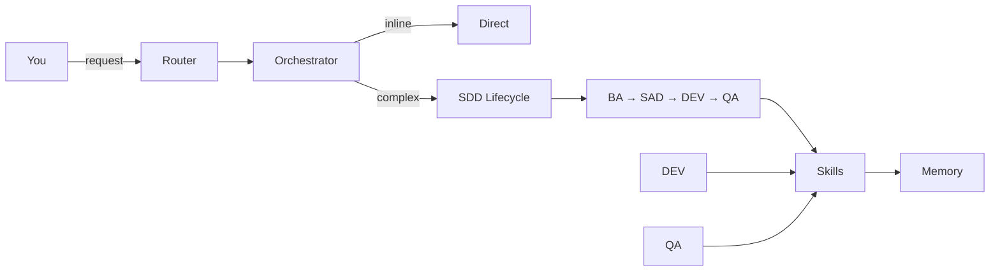

<p align="center">
  
</p>

<p align="center">
  
  
  
  
  
  
  
  
</p>

<p align="center">
  <a href="https://github.com/EmmanuelOrtiz87/gentle-vanguard-public">GitHub</a>
  &nbsp;·&nbsp;
  <a href="docs/">Documentation</a>
  &nbsp;·&nbsp;
  <a href="../../releases">Releases</a>
  &nbsp;·&nbsp;
  <a href="SECURITY.md">Security</a>
</p>

<p align="center">
  <strong>AI-powered development orchestrator · 18 agents · 135 skills · 10 tool-compatible</strong><br>
  <em>Tool-agnostic · SDD Lifecycle · Judgment Day · Persistent memory</em>
</p>

> _"Construyendo el puente definitivo entre la alta ingeniería de software y la estrategia
> corporativa."_

Born from a simple observation: AI-assisted coding works, but without structure it's chaotic.
Gentle-Vanguard gives you an orchestration layer that routes tasks to specialized agents, enforces
standards, tracks every token, and remembers what you did last session.

---

## What It Solves

| Problem                         | How Gentle-Vanguard Solves It                                   |
| ------------------------------- | --------------------------------------------------------------- |
| AI code quality varies wildly   | Multi-layer validation gates catch issues before commit         |
| No session-to-session memory    | Persistent memory system recalls decisions across sessions      |
| Token waste from wrong models   | Cost-aware router assigns optimal model per task type           |
| Unstructured AI workflows       | SDD lifecycle enforces spec-driven development                  |
| Disconnected tool sessions      | Session manager tracks context with crash recovery              |
| No AI cost visibility           | Dashboard with token trends and per-agent analytics             |
| One-size AI responses           | 15+ specialized agents with role-specific profiles              |
| Locked into one AI tool         | Runtime detection adapts to 10+ coding tools seamlessly         |

---

## Architecture



### 5-Layer Architecture

| Layer              | Role                  | Components                                          |
| ------------------ | --------------------- | --------------------------------------------------- |
| **1. Agents**      | Task delegation       | Orchestrator + specialized sub-agents               |
| **2. Commands**    | CLI entry points      | `gv` CLI, pre-process router                        |
| **3. MCP Servers** | Protocol bridge       | MCP protocol for skill communication                |
| **4. Skills**      | Specialized execution | 135+ skills across all domains                      |
| **5. Memory**      | Persistent context    | Cross-session memory with hot/warm/cold tiers       |

---

## Agent Ecosystem

| Agent     | Role                    |
| --------- | ----------------------- |
| BA        | Requirements & analysis |
| SAD       | System design           |
| DEV       | Code generation         |
| QA        | Testing & validation    |
| OPS       | Deployment & CI/CD      |
| GOV       | Compliance & audit      |
| DOC       | Technical docs          |
| SESSION   | Session management      |
| PREMORTEM | Risk assessment         |
| FINANCE   | Financial modeling      |
| LEGAL     | Regulatory compliance   |
| MKT       | Marketing & SEO         |
| SALES     | Pipeline management     |
| HR        | Talent acquisition      |

> 18 specialized agents orchestrated by a central router. Each agent has an optimized model profile (fast/cheap, strong-reasoning, or strong-coding) assigned per role.

---

## Key Features

- **18 specialized agents** with role-specific model routing
- **135+ on-demand skills** across frontend, backend, DevOps, security, testing, business
- **Persistent cross-session memory** with conflict detection and auto-reconciliation
- **Cost-aware model router** — assigns optimal model per task type
- **SDD lifecycle** — Spec-Driven Development with per-phase quality gates
- **Multi-layer governance** — adversarial review, pre-commit hooks, CI/CD enforcement
- **100% local-first** — no required external services
- **Cross-platform** — Windows, macOS, Linux
- **10 tool-compatible** — OpenCode, Claude Code, Cline, Cursor, Windsurf, and more
- **Token optimization stack** — compression, caching, model cost reduction
- **CLI** with 50+ subcommands

---

## Skill Catalog

| Category              | Count | Examples                              |
| --------------------- | ----- | ------------------------------------- |
| Frontend/Mobile       | 25    | React, Angular, Next.js, Flutter      |
| Backend               | 5     | Go, Django, API Design, Databases     |
| DevOps/Infra          | 8     | Docker, Kubernetes, Terraform         |
| Security & Governance | 8     | Security audit, adversarial review    |
| Testing/QA            | 8     | Playwright, pytest, BDD               |
| Content/Marketing     | 14    | SEO, content strategy, visual design  |
| Business              | 14    | Finance, sales, HR, legal             |
| Git/Workflow          | 9     | Branch/PR management, release         |
| Core/Orchestration    | 15    | SDD lifecycle, session mgmt, routing  |
| Other                 | 40    | Scaffolding, incident response, risk  |

---

## Quick Install

### Windows — One-Click

[Download Gentle-Vanguard.exe](https://github.com/EmmanuelOrtiz87/gentle-vanguard/releases) — NSIS installer, AES-256 encrypted.

```powershell
# Run as Administrator, then verify:
gv health
```

### Any Platform — Git Clone

```powershell
git clone https://github.com/EmmanuelOrtiz87/gentle-vanguard-public.git
cd gentle-vanguard-public
pwsh -File scripts/bootstrap.ps1
```

---

## Requirements

| Requirement | Version       | Required?   | Notes            |
| ----------- | ------------- | ----------- | ---------------- |
| PowerShell  | 7+            | Yes         | Core runtime     |
| Git         | 2.30+         | Yes         | Version control  |
| Windows     | 10/11         | Optional    | Full support     |
| macOS       | 13+           | Optional    | Full support     |
| Linux       | Ubuntu 22.04+ | Optional    | Full support     |
| RAM         | 4 GB min      | Recommended | 8 GB recommended |

---

## CI/CD Pipeline (16 Workflows)

Automated validation across quality gates, security scanning, testing, and reporting — triggered on PRs, pushes, scheduled intervals, or tags.

---

## Defensive Patterns

All scripts follow standardized patterns for robustness and security: strict error handling, validated parameters, no hardcoded paths, SHA256 integrity baselines, and BOM-free UTF-8 encoding.

---

## Documentation

| Resource           | Link                                                       |
| ------------------ | ---------------------------------------------------------- |
| Getting Started    | [docs/getting-started/](docs/getting-started/)             |
| Installation Guide | [docs/reference/FOUNDATION-INSTALLER.md](docs/reference/FOUNDATION-INSTALLER.md) |
| Architecture       | [docs/architecture/README.md](docs/architecture/README.md) |
| Full Index         | [docs/](docs/)                                             |

---

## Security

AES-256 encryption for secrets, API keys, and sensitive configs. See [SECURITY.md](SECURITY.md).

---

## License

[MIT](LICENSE)

---

<p align="center">
  <strong>Gentle-Vanguard v2.24.0</strong><br>
  <em>Local-First · Total Privacy · Production Ready</em>
</p>
