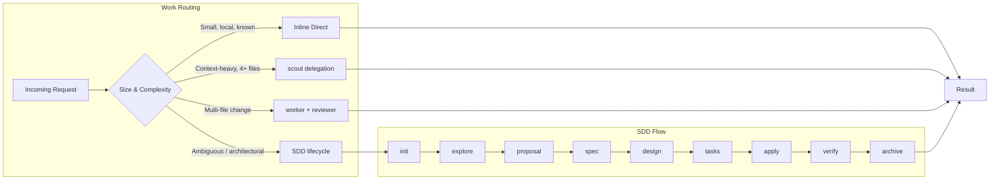
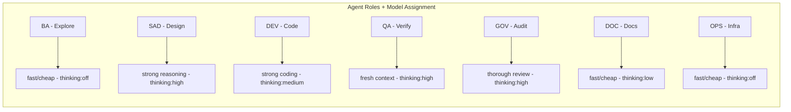

<h1 align="center">Foundation</h1>

<p align="center">
  <strong>AI-powered development orchestrator · 18 specialized agents · 130+ skills</strong><br>
  <em>100% local · Persistent memory · No vendor lock-in · Production ready</em>
</p>

<p align="center">
  
  
  
  
  
  
</p>

<p align="center">
  <a href="docs/AGENTS.md">Bootstrap</a>
  &nbsp;middot;&nbsp;
  <a href="CHANGELOG.md">Changelog</a>
  &nbsp;middot;&nbsp;
  <a href="rules/DELEGATION-RULES.md">Delegation Rules</a>
  &nbsp;middot;&nbsp;
  <a href="openspec/config.yaml">SDD Config</a>
</p>

---

## What is Foundation?

Foundation is an **AI orchestrator** that turns your CLI or IDE into a disciplined engineering team. Unlike chat wrappers, Foundation:

- **Routes work** through delegation rules: small changes stay inline, complex work goes to specialized subagents
- **Enforces SDD** (Spec-Driven Development): concepts before code, artifacts over chat context
- **Guards reviewer workload**: prevents oversized PRs with automated line-budget checks
- **Assigns models per agent**: fast/cheap for exploration, strong reasoning for architecture, fresh context for review
- **Maintains a skill registry**: auto-scanned, always-current index of 130+ skills
- **Persists memory** across sessions via Engram


---

## Architecture

### Work Routing Ladder

Foundation routes every request through the **smallest safe harness**:



### Delegation Rules (Mandatory)

| # | Rule | Trigger | Action |
|---|------|---------|--------|
| 1 | **4-file rule** | Understanding needs 4+ files | Delegate to scout/context-builder |
| 2 | **Multi-file write** | Touching 2+ non-trivial files | One worker + fresh reviewer |
| 3 | **PR rule** | Before commit/push/PR | Fresh-context reviewer |
| 4 | **Incident rule** | Git/tooling accident | Fresh audit before recovery |
| 5 | **Long-session** | ~20 calls without delegation | Pause and delegate |

See [rules/DELEGATION-RULES.md](rules/DELEGATION-RULES.md) for full details.

### Model Routing per Agent

Each agent type has a recommended model profile based on its role:



Configured in [config/model-routing.json](config/model-routing.json).

### Agent Ecosystem

| Agent | Role | Model Profile | Delegates to |
|-------|------|--------------|-------------|
| Orchestrator | Main router | inherit | All agents below |
| BA | Requirements & analysis | fast/cheap | `sdd-lifecycle` (explore) |
| SAD | System design | strong-reasoning | `sdd-lifecycle` (design) |
| DEV | Code generation | strong-coding | `sdd-lifecycle` (apply) |
| QA | Testing & validation | strong-review | `sdd-lifecycle` (verify) |
| OPS | Deployment & CI/CD | fast/cheap | `docker-devops-skill` |
| DOC | Technical docs | fast/cheap | `documentation-governance` |
| GOV | Compliance & audit | strong-review | `judgment-day` |
| PREMORTEM | Risk assessment | strong-reasoning | `premortem-skill` |
| SESSION | Session management | fast/cheap | `session-workflow-skill` |
| FINANCE | Financial modeling | strong-reasoning | `finance-financial-analyst` |
| LEGAL | Regulatory compliance | strong-review | `legal-compliance-officer` |
| MKT | Marketing & SEO | fast/cheap | `marketing-content-writer` |
| SALES | Pipeline management | fast/cheap | `sales-account-executive` |
| HR | Talent acquisition | fast/cheap | `hr-talent-acquisition` |
| SELF-DIAG | Self-diagnosis | fast/cheap | `self-diagnosis-skill` |

---

## Key Capabilities

### SDD / OpenSpec

Foundation implements Spec-Driven Development with a formal phase chain:

```
init  explore  proposal  spec  design  tasks  apply  verify  archive
```

Config at [openspec/config.yaml](openspec/config.yaml):
- `strict_tdd`: forces RED/GREEN/TRIANGULATE/REFACTOR evidence
- `protect_review_workload`: blocks PRs exceeding 400 lines
- Per-phase rules: proposal requires problem statement, spec requires acceptance criteria

Run `scripts/utilities/sdd-preflight.ps1 -Interactive` once per session to set your SDD preferences.

### SDD Preflight (Session-Level)

Before the first SDD flow in a session, configure:

| Setting | Options | Default |
|---------|---------|---------|
| Execution mode | interactive / auto | interactive |
| Artifact store | openspec / engram / both | openspec |
| PR strategy | auto-forecast / ask-always / single-pr-default / force-chained | ask-always |
| Review budget | Max lines per PR (default: 400) | 400 |
| Strict TDD | enabled / disabled | enabled |

### Review Workload Guard

Before multi-file implementation, estimate the review burden:

```powershell
.\scripts\utilities\review-workload-guard.ps1
```

- Checks `git diff main...` for additions + deletions
- If **>400 changed lines**, recommends chained PRs (see `skills/chained-pr/`)
- Splits oversized work into reviewable slices

### Skill Registry

Foundation auto-maintains a skill registry at `.atl/skill-registry.md`:

- Built on every session start
- Scans 10+ skill directories (project + user/tool)
- Generates **compact rules**: 5-15 line pre-digested summaries per skill
- Delegators inject compact rules into subagent prompts

Rebuild on demand:
```powershell
.\scripts\utilities\build-skill-registry.ps1
```

### Chain-Delivery Skills

| Skill | Purpose |
|-------|---------|
| `branch-pr` | Issue-first PR creation with template enforcement |
| `chained-pr` | Split >400-line changes into reviewable PR chains |
| `work-unit-commits` | Commits as self-contained, reviewable units |
| `judgment-day` | Blind dual review + re-judgment |
| `comment-writer` | Postable, warm collaboration comments |

---

## Quick Start

```powershell
git clone https://github.com/EmmanuelOrtiz87/foundation.git
cd foundation

# Full session start (autostart + session manager + engram + skill registry)
.\scripts\utilities\session-autostart.cmd

# Verify all quality gates
foundation verify

# Run the declared real coverage gate explicitly
pwsh -File .\scripts\utilities\verify-coverage.ps1

# SDD preflight (before first SDD task)
.\scripts\utilities\sdd-preflight.ps1 -Interactive

# Check review workload before multi-file changes
.\scripts\utilities\review-workload-guard.ps1
```

---

## Development

| Action | Command |
|--------|---------|
| Build installer | `pwsh -File build/create-installer.ps1` |
| Run all tests | `Invoke-Pester tests/ -Output Detailed` |
| Run unit tests | `Invoke-Pester tests/unit/ -Output Detailed` |
| Run integration | `Invoke-Pester tests/integration/ -Output Detailed` |
| Real coverage gate | `pwsh -File .\scripts\utilities\verify-coverage.ps1` |
| Session persistence tests | `Invoke-Pester tests/integration/engram-session-persistence.integration.tests.ps1 -Output Detailed` |
| Learning workflow tests | `Invoke-Pester tests/integration/post-session-learning.integration.tests.ps1 -Output Detailed` |
| Quality gates | `foundation verify` or `foundation judgment-day` |
| Security audit | `.\scripts\security\audit.ps1` |
| Rebuild skill registry | `.\scripts\utilities\build-skill-registry.ps1` |

See [build/README.md](build/README.md) for the full build pipeline.

Session lifecycle is now persisted end-to-end through Engram: `session-manager.ps1` saves session start and closure records, `post-session-learning.ps1` saves searchable learning summaries or proposals, and `config/mcp-servers.json` registers the native `engram-kb` MCP endpoint through `tools\engram.exe mcp --tools=agent`.

---

## Project Status

| Gate | Result |
|------|--------|
| Configuration | 3/3 |
| Skills | 130+ validated |
| Tests | 442 passing |
| Hooks | 2/2 |
| Structure | 7/7 |
| **Total** | **Production Ready** |

---

## Key Documentation

| Resource | Description |
|----------|-------------|
| [AGENTS.md](docs/AGENTS.md) | Canonical bootstrap (tool-agnostic) |
| [Architecture](docs/architecture/README.md) | System design & decisions |
| [Delegation Rules](rules/DELEGATION-RULES.md) | When to delegate vs. work inline |
| [Model Routing](config/model-routing.json) | Per-agent model/effort assignments |
| [SDD Config](openspec/config.yaml) | SDD/OpenSpec phase configuration |
| [Skill Registry](.atl/skill-registry.md) | Auto-maintained skill index |
| [Build Pipeline](build/README.md) | Encrypt, compile, distribute |
| [Contributing](CONTRIBUTING.md) | How to contribute |
| [Changelog](CHANGELOG.md) | Version history |

---

<p align="center">
  <strong>Foundation v2.15.0</strong><br>
  <em>Local-First · Total Privacy · Production Ready</em>
</p>
