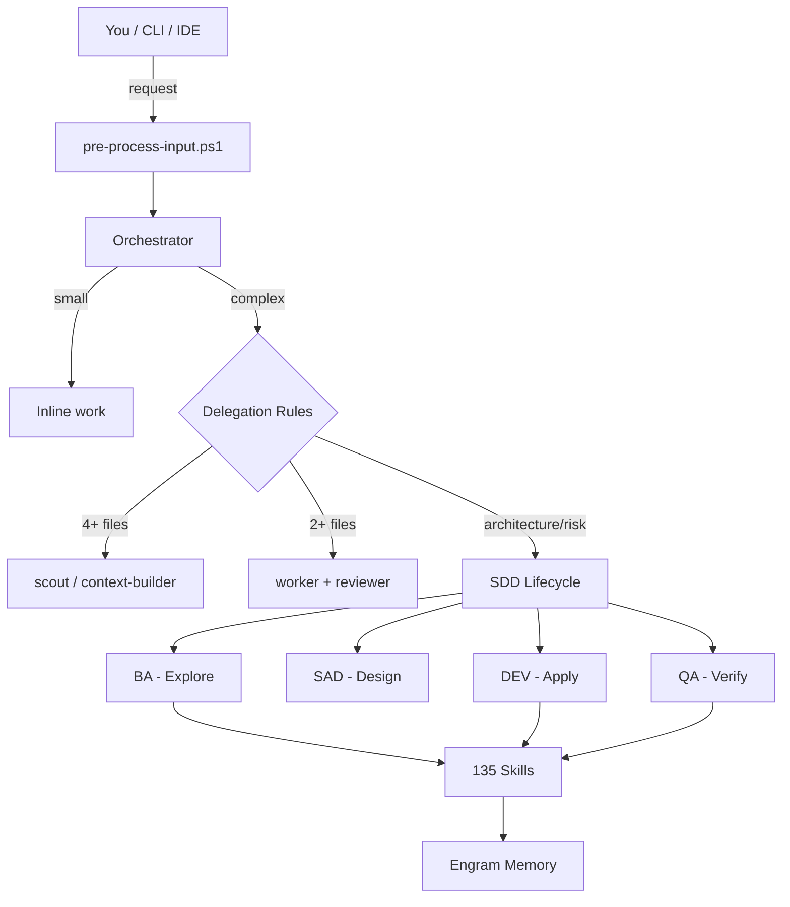
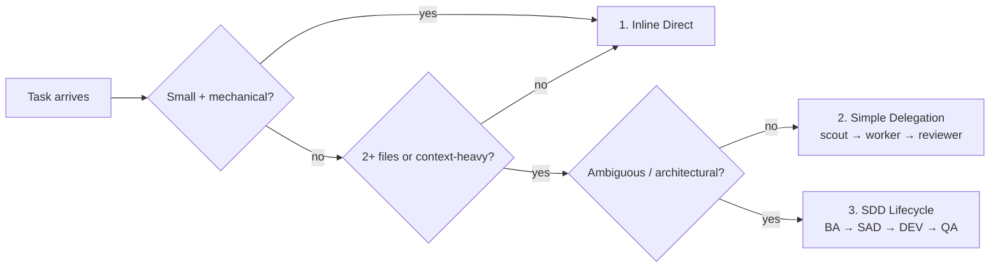
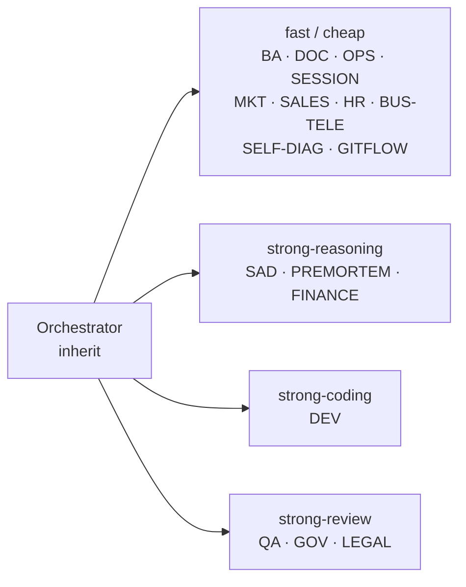
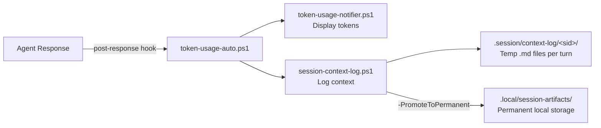
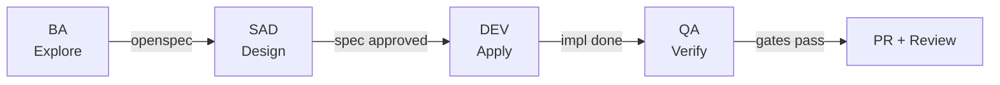

<p align="center">
  
</p>

<p align="center">
  
  
  
  
  
  
  
</p>

<p align="center">
  <a href="docs/AGENTS.md">Bootstrap</a> &nbsp;·&nbsp;
  <a href="docs/architecture/README.md">Architecture</a> &nbsp;·&nbsp;
  <a href="rules/DELEGATION-RULES.md">Delegation Rules</a> &nbsp;·&nbsp;
  <a href="config/model-routing.json">Model Routing</a> &nbsp;·&nbsp;
  <a href="openspec/config.yaml">SDD Config</a> &nbsp;·&nbsp;
  <a href=".atl/skill-registry.md">Skill Registry</a> &nbsp;·&nbsp;
  <a href="CHANGELOG.md">Changelog</a>
</p>

<p align="center">
  <strong>AI-powered development orchestrator · 18 agents · 135 skills · 10 tool-compatible</strong><br>
  <em>Tool-agnostic · SDD Lifecycle · Judgment Day · Persistent memory</em>
</p>

> _"Construyendo el puente definitivo entre la alta ingeniería de software y la estrategia
> corporativa."_ — [Read the Manifesto](MANIFESTO.md)

---

## What is Gentle-Vanguard?

Gentle-Vanguard is an AI orchestration layer built on top of any coding tool (OpenCode, Claude Code,
Cline, Cursor, Windsurf, Codex, Copilot). It gives structure, memory, and governance to what would
otherwise be chaotic AI-assisted development.

- **Routes work** through `pre-process-input.ps1` → trigger matching → agent dispatch (inline,
  delegate, or SDD)
- **18 specialized agents** each with a narrow role, a model profile, and delegation rules
- **135 On-Demand Skills** — Angular, React, Next.js, Go, Django, Python, TypeScript, Docker, K8s,
  Playwright, Security, API Design — zero memory until triggered
- **Persists memory** via Engram — decisions, bugs, and patterns across sessions with hot/warm/cold
  tiers
- **Cost-aware model router** assigns fast/cheap, strong-reasoning, or strong-coding profiles per
  agent
- **Enforces SDD lifecycle** (BA → SAD → DEV → QA) on ambiguous or architectural work
- **Governance-first** — 7D validation, judgment-day adversarial review, pre-commit hooks, 16 CI/CD
  workflows



---

## Architecture

### Work Routing Ladder



### Delegation Rules

| #   | Rule                      | Trigger                                     | Action                              |
| --- | ------------------------- | ------------------------------------------- | ----------------------------------- |
| 1   | **4-file rule**           | Understanding requires reading 4+ files     | Launch `scout` with fresh context   |
| 2   | **Multi-file write rule** | Implementation touches 2+ non-trivial files | Use one `worker` + fresh `reviewer` |
| 3   | **PR rule**               | Before commit/push/PR for code changes      | Run fresh-context `reviewer`        |
| 4   | **Incident rule**         | Wrong cwd, git mutation, failed merge       | Stop and run fresh audit `reviewer` |
| 5   | **Long-session rule**     | ~20 tool calls or 5 exploratory reads       | Pause and delegate                  |
| 6   | **Fresh review rule**     | Adversarial review of diffs or PR readiness | Use `context: "fresh"` reviewer     |

### Model Routing per Agent



### 5-Layer Architecture

| Layer              | Role                  | Components                                    | Config                           |
| ------------------ | --------------------- | --------------------------------------------- | -------------------------------- |
| **1. Agents**      | Task delegation       | 1 orchestrator + 17 sub-agents                | `config/auto-delegation.json`    |
| **2. Commands**    | CLI entry points      | `gv.ps1`, `pre-process-input.ps1`             | `config/orchestrator.json`       |
| **3. MCP Servers** | Protocol bridge       | Model Context Protocol, Engram MCP, CodeGraph | `opencode.json#mcp`              |
| **4. Skills**      | Specialized execution | 135 skills across 10 categories               | `config/skill-dependencies.json` |
| **5. Memory**      | Persistent context    | Engram (hot/warm/cold tiers)                  | `config/engram-config.json`      |

---

## Agent Ecosystem

| Agent            | Role                    | Model Profile    | Delegates to   |
| ---------------- | ----------------------- | ---------------- | -------------- |
| Orchestrator     | Main router             | inherit          | All sub-agents |
| BA (sdd-explore) | Requirements & analysis | fast/cheap       | SAD, skills    |
| SAD (sdd-design) | System design           | strong-reasoning | DEV            |
| DEV (sdd-apply)  | Code generation         | strong-coding    | QA, reviewer   |
| QA (sdd-verify)  | Testing & validation    | strong-review    | DEV (feedback) |
| OPS              | Deployment & CI/CD      | fast/cheap       | —              |
| DOC              | Technical docs          | fast/cheap       | —              |
| GOV              | Compliance & audit      | strong-review    | —              |
| SESSION          | Session management      | fast/cheap       | —              |
| PREMORTEM        | Risk assessment         | strong-reasoning | SAD            |
| FINANCE          | Financial modeling      | strong-reasoning | —              |
| LEGAL            | Regulatory compliance   | strong-review    | —              |
| MKT              | Marketing & SEO         | fast/cheap       | —              |
| SALES            | Pipeline management     | fast/cheap       | —              |
| HR               | Talent acquisition      | fast/cheap       | —              |
| SELF-DIAG        | Self-diagnosis          | fast/cheap       | ORC            |
| BUS-TELE         | Business telemetry      | fast/cheap       | —              |
| CODEGRAPH        | Code analysis           | fast/cheap       | —              |

> All sub-agents are `hidden: true` — only the Orchestrator is user-selectable. Sub-agents are
> managed autonomously via `config/auto-delegation.json`.

---

### Session Context Logging

Every agent response is tracked for token consumption, context size, and cost estimation:



| Component | Location | Purpose |
|-----------|----------|---------|
| `session-context-log.ps1` | `scripts/utilities/` | **Permanent** — Init, log, close, status, reinit |
| `token-usage-auto.ps1` | `scripts/utilities/` | **Permanent** — Integrates notifier + context logger |
| `context-summary.md` | `.session/context-log/<sid>/` | **Temp** — Full session log (gitignored) |
| `turn-NNN.md` | `.session/context-log/<sid>/` | **Temp** — Per-turn detail (gitignored) |
| `context-log-<sid>/` | `.local/session-artifacts/` | **Permanent local** — Promoted with `-PromoteToPermanent` |

**Usage** (called automatically by the agent after every response):
```powershell
pwsh -NoProfile -File scripts/utilities/token-usage-auto.ps1 `
  -InputTokens <N> -OutputTokens <N> -ContextChars <N> `
  -InputSummary "<user intent>" -OutputSummary "<response>" `
  -TurnLabel "<task>"
```

At session close:
```powershell
pwsh -NoProfile -File scripts/utilities/session-context-log.ps1 -Action close
# Or with permanent promotion:
pwsh -NoProfile -File scripts/utilities/session-context-log.ps1 -Action close -PromoteToPermanent
```

Config references: `docs/AGENTS.md#post-response-context-logging-rule`, `CLAUDE.md` rules #14-#15.

---
## Key Capabilities

### SDD / OpenSpec Lifecycle

Spec-Driven Development enforces a 4-phase lifecycle for ambiguous, architectural, or cross-cutting
work.



Config: `openspec/config.yaml` — strict TDD, per-phase gates, testing layers, skip rules.

### SDD Preflight

Run once per session before the first SDD flow:

| Setting        | Options                        | Default       |
| -------------- | ------------------------------ | ------------- |
| Mode           | `interactive` / `auto`         | `interactive` |
| Artifact store | `openspec` / `engram` / `both` | `both`        |
| PR strategy    | `single` / `chained`           | `chained`     |
| Review budget  | lines per PR                   | 400           |

```powershell
.\scripts\utilities\sdd-preflight.ps1 -Interactive
```

### Review Workload Guard

Before any `sdd-apply` phase or multi-file implementation:

```powershell
.\scripts\utilities\review-workload-guard.ps1
```

Blocks PRs exceeding 400 changed lines. Recommends chained PRs (see `skills/chained-pr/SKILL.md`).
Cognitive research shows review quality drops sharply above this threshold.

### Skill Registry

135 skills auto-indexed at session start. Registry is rebuilt on install/removal:

```powershell
.\scripts\utilities\build-skill-registry.ps1
```

Authoritative index: `.atl/skill-registry.md`

### Chain-Delivery Skills

For large features that exceed the 400-line review budget, use chained PR delivery:

- `skills/chained-pr/SKILL.md` — planning and splitting
- `skills/branch-pr/SKILL.md` — branch + PR workflow
- `skills/gitflow-orchestrator-skill/SKILL.md` — full gitflow

### Cross-Tool Compatibility

Compatible with 10 tools via `scripts/utilities/detect-tool.ps1`:

| Tool             | Config File                       | Response Profile |
| ---------------- | --------------------------------- | ---------------- |
| OpenCode         | `opencode.json`                   | ultra            |
| Claude Code      | `.claude/settings.json`           | ultra            |
| Cline            | `.clinerules`                     | ultra            |
| Cursor           | `.cursorrules`                    | ultra            |
| Windsurf         | `.windsurf/`                      | ultra            |
| Codex            | `.codex/`                         | standard         |
| Copilot          | `.github/copilot-instructions.md` | standard         |
| Antigravity      | `.antigravity/`                   | standard         |
| Continue.dev     | `.continue/`                      | standard         |
| Claude (generic) | `CLAUDE.md`                       | ultra            |

---

## Quick Start

```powershell
# 1. Clone
git clone https://github.com/EmmanuelOrtiz87/gentle-vanguard.git
cd gentle-vanguard

# 2. Start session (activates notifications, security, engram, token guard)
.\scripts\utilities\session-autostart.cmd

# 3. Verify workspace
gv health

# 4. SDD preflight (before first SDD flow)
.\scripts\utilities\sdd-preflight.ps1 -Interactive

# 5. Review workload guard (before multi-file work)
.\scripts\utilities\review-workload-guard.ps1
```

---

## Development

| Command                                                  | Purpose                           |
| -------------------------------------------------------- | --------------------------------- |
| `gv verify`                                              | Run all quality gates             |
| `gv judgment-day`                                        | Full adversarial review           |
| `gv dashboard`                                           | Open HTML metrics dashboard       |
| `gv benchmark`                                           | SLO benchmark of key commands     |
| `gv version`                                             | Show stack version + skills count |
| `pwsh -File tests/run-tests.ps1`                         | Run full test suite               |
| `Invoke-Pester -Path tests/ -Output Detailed`            | Run Pester unit tests             |
| `pwsh -File scripts/utilities/build-skill-registry.ps1`  | Rebuild skill registry            |
| `pwsh -File scripts/utilities/security-audit.ps1`        | Run security audit                |
| `pwsh -File scripts/utilities/validate-readme.ps1`       | Validate README structure         |
| `pwsh -File scripts/utilities/review-workload-guard.ps1` | Estimate PR review workload       |
| `pwsh -File scripts/utilities/sdd-preflight.ps1`         | Configure SDD session             |
| `npm run format`                                         | Run Prettier formatting           |
| `Invoke-PSScriptAnalyzer -Path scripts/ -Recurse`        | PSScriptAnalyzer lint             |

---

## CI/CD Pipeline (16 Workflows)

| Workflow                           | Purpose                          | Trigger              |
| ---------------------------------- | -------------------------------- | -------------------- |
| `gentle-vanguard-quality-gate.yml` | Quality gates on PRs             | Every PR             |
| `test-suite.yml`                   | Full test suite                  | Every PR/push        |
| `ps-lint.yml`                      | PSScriptAnalyzer lint            | Every PR             |
| `sdd-gate.yml`                     | Block PRs without SDD            | Every PR             |
| `script-governance.yml`            | Script compliance                | Every PR             |
| `format-check.yml`                 | Prettier formatting              | Every PR             |
| `gitleaks.yml`                     | Secret scanning                  | Every PR             |
| `security-scan.yml`                | OWASP security scanning          | Weekly               |
| `autonomous-validation.yml`        | Full validation suite            | Weekly               |
| `cross-platform-tests.yml`         | Cross-platform tests             | Every PR/push        |
| `dashboard-auto-refresh.yml`       | Metrics dashboard                | Daily                |
| `monthly-management-report.yml`    | Executive report                 | Monthly              |
| `release.yml`                      | Release management               | On tag               |
| `labeler.yml`                      | Auto-label PRs                   | Every PR             |
| `sync-public.yml`                  | Sync to `gentle-vanguard-public` | On push to `main`    |
| `workflow-lint.yml`                | Workflow syntax validation       | On `.github/` change |

---

## Project Status

| Gate          | Status  | Detail                                                                  |
| ------------- | ------- | ----------------------------------------------------------------------- |
| Configuration | ✅ PASS | `orchestrator.json`, `auto-delegation.json`, `model-routing.json` valid |
| Skills        | ✅ PASS | 135 skills indexed, registry current                                    |
| Tests         | ✅ PASS | Full test suite passing                                                 |
| Hooks         | ✅ PASS | Pre-commit hooks active (README, secrets, lint)                         |
| Context Log   | ✅ PASS | Session context logging active — tokens, cost, input/output per turn    |
| Structure     | ✅ PASS | All mandatory files present                                             |
| Engram        | ✅ PASS | Memory store accessible, sessions tracking                              |
| SDD           | ✅ PASS | OpenSpec config valid, preflight operational                            |

---

## Key Documentation

| Resource                  | Path                                                       |
| ------------------------- | ---------------------------------------------------------- |
| **Agent Bootstrap**       | [docs/AGENTS.md](docs/AGENTS.md)                           |
| **Context Logging**       | [docs/AGENTS.md#post-response-context-logging-rule](docs/AGENTS.md) |
| **Architecture Overview** | [docs/architecture/README.md](docs/architecture/README.md) |
| **Delegation Rules**      | [rules/DELEGATION-RULES.md](rules/DELEGATION-RULES.md)     |
| **Model Routing**         | [config/model-routing.json](config/model-routing.json)     |
| **SDD Config**            | [openspec/config.yaml](openspec/config.yaml)               |
| **Skill Registry**        | [.atl/skill-registry.md](.atl/skill-registry.md)           |
| **README Governance**     | [rules/README-GOVERNANCE.md](rules/README-GOVERNANCE.md)   |
| **Build Pipeline**        | [docs/build/README.md](build/README.md)                    |
| **Contributing**          | [CONTRIBUTING.md](CONTRIBUTING.md)                         |
| **Changelog**             | [CHANGELOG.md](CHANGELOG.md)                               |

---

## Security

AES-256 encryption for secrets, API keys, and sensitive configs. See [SECURITY.md](SECURITY.md).

---

## License

[MIT](LICENSE)

---

<p align="center">
  <strong>Gentle-Vanguard v2.20.0</strong><br>
  <em>Local-First · Total Privacy · Production Ready</em>
</p>
