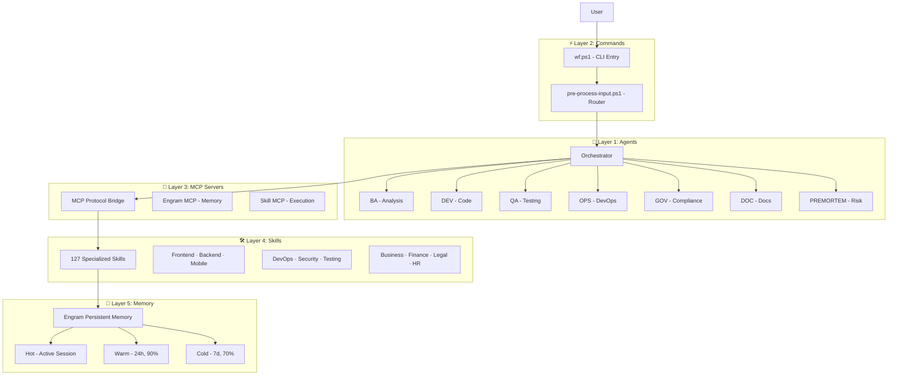
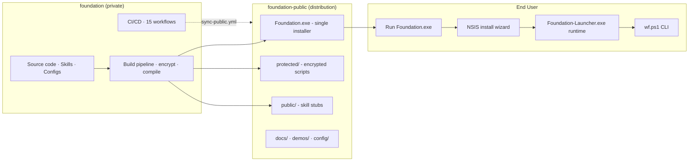

<h1 align="center">🚀 Foundation</h1>

<p align="center">
  <strong>🤖 AI-first development stack · Zero vendor lock-in · 127 skills</strong><br>
  <em>🔒 Local-first · 🛡️ Privacy-first · ⚡ Production Ready</em>
</p>

<p align="center">
  
  
  
  
  
  
</p>

> **📢 Public release**: [`foundation-public`](https://github.com/EmmanuelOrtiz87/foundation-public) — single installer, public documentation, and demos.

---

## ⚡ Quick Start

```powershell
.\scripts\utilities\session-autostart.cmd   # Start a session
wf verify                                    # Validate 14 quality gates
wf version                                   # Version + skill count
wf start-session | wf dashboard | wf judgment-day
```

### Installation Methods

| Method | Command | Audience |
|--------|---------|----------|
| 📥 Installer | `Foundation.exe` (from foundation-public) | End users |
| 🛠️ Bootstrap | `.\scripts\foundation\bootstrap.ps1` | Developers |
| 🔄 Multi-PC | `.\scripts\foundation\setup-multi-machine.ps1` | Enterprise |

> 💡 **Single distributable**: `Foundation.exe` is the only file you need — professional NSIS wizard, AES-256 encrypted.

---

## 🏛️ Architecture

### 5-Layer Topology



### Request Flow

```mermaid
sequenceDiagram
    actor User
    participant CLI as wf.ps1
    participant Router as pre-process-input.ps1
    participant Agent as Orchestrator Agent
    participant MCP as MCP Server
    participant Skill as Skill
    participant Mem as Engram

    User->>CLI: wf &lt;command&gt;
    CLI->>Router: pre-process input
    Router-->>CLI: route to agent
    CLI->>Agent: delegate task

    Agent->>MCP: activate skill MCP
    MCP->>Skill: execute skill
    Skill->>Mem: save context
    Mem-->>Skill: restore memory
    Skill-->>MCP: result
    MCP-->>Agent: skill output
    Agent-->>CLI: final result
    CLI-->>User: response
```

---

## 🤖 Agent Ecosystem

| Agent | Role | Skill |
|-------|------|-------|
| 🧭 Orchestrator | Main router | `project-orchestrator-skill` |
| 🔍 BA | Requirements & analysis | `sdd-lifecycle` |
| 🏗️ DEV | Code generation | `sdd-lifecycle` |
| 🏛️ SAD | System design | `sdd-lifecycle` |
| ✅ QA | Testing & validation | `sdd-lifecycle` |
| 🚀 OPS | Deployment & CI/CD | `docker-devops-skill` |
| 📖 DOC | Technical docs | `documentation-governance` |
| 🛡️ GOV | Compliance & security | `judgment-day` |
| 🔮 PREMORTEM | Risk assessment | `premortem-skill` |
| 💰 FINANCE | Financial modeling | `finance-financial-analyst` |
| ⚖️ LEGAL | Regulatory compliance | `legal-compliance-officer` |
| 📢 MKT | Marketing & SEO | `marketing-content-writer` |
| 💼 SALES | Pipeline management | `sales-account-executive` |
| 👥 HR | Talent acquisition | `hr-talent-acquisition` |

> Auto-delegation via `config/auto-delegation.json`. Sub-agents are `hidden: true` — only Orchestrator is exposed to the user.

---

## 🗂️ Project Ecosystem



---

## 🔄 CI/CD (15 workflows)

| Workflow | Purpose | Trigger |
|----------|---------|---------|
| `foundation-quality-gate.yml` | Quality gates | Every PR |
| `test-suite.yml` | 33 tests | Every PR/push |
| `ps-lint.yml` | PSScriptAnalyzer | Every PR |
| `gitleaks.yml` | Secret scanning | Every PR |
| `codeql-analysis.yml` | CodeQL analysis | Weekly |
| `security-scan.yml` | OWASP scanning | Weekly |
| `sync-public.yml` | Sync → foundation-public | Push to develop |

---

## 📁 Project Structure

```
foundation/
├── config/          # orchestrator.json, auto-delegation.json, model-router.json
├── docs/            # Architecture, guides, reference, assets
├── scripts/         # Utilities, bootstrap, git-hooks, security
├── skills/          # 127 skill definitions (MCP servers)
├── tests/           # 33 tests (unit + integration)
├── .github/         # 15 CI/CD workflows
├── build/           # Build pipeline (encrypt, compile installer)
├── dist/            # Foundation.exe output
└── templates/       # Project scaffolding (frontend, backend, mobile, CLI...)
```

> See `docs/architecture/` for detailed architecture documentation.

---

## ✅ Validation

| Gate | Result |
|------|--------|
| ⚙️ CONFIG | ✅ 3/3 |
| 🛠️ SKILLS | ✅ 127 validated |
| 🧪 TESTS | ✅ 33 passing |
| 🔗 HOOKS | ✅ 2/2 |
| 📁 STRUCTURE | ✅ 7/7 |
| **Total** | **✅ 14/14 PASS** |

---

## 📚 Key Docs

| Resource | Description |
|---------|-------------|
| [AGENTS.md](docs/AGENTS.md) | Canonical bootstrap (tool-agnostic) |
| [Getting Started](docs/getting-started/README.md) | Setup guide |
| [Architecture](docs/architecture/README.md) | System design |
| [Build Pipeline](build/README.md) | Encrypting, compiling, distributing |
| [Skill Catalog](docs/reference/SKILL-ORGANIZATION.md) | 127 skills reference |
| [Changelog](CHANGELOG.md) | Versions |
| [Contributing](CONTRIBUTING.md) | How to contribute |
| [Public Release](https://github.com/EmmanuelOrtiz87/foundation-public) | foundation-public |

---

<p align="center">
  <strong>🚀 Foundation v2.9.1</strong><br>
  <em>🔒 Local-First · 🛡️ Total Privacy · ✅ Production Ready</em><br>
  <sub><a href="https://github.com/EmmanuelOrtiz87/foundation">github.com/EmmanuelOrtiz87/foundation</a></sub>
</p>
