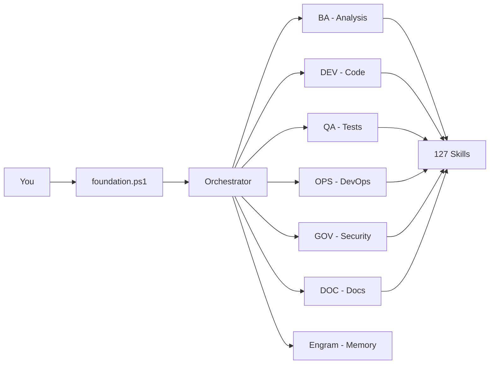
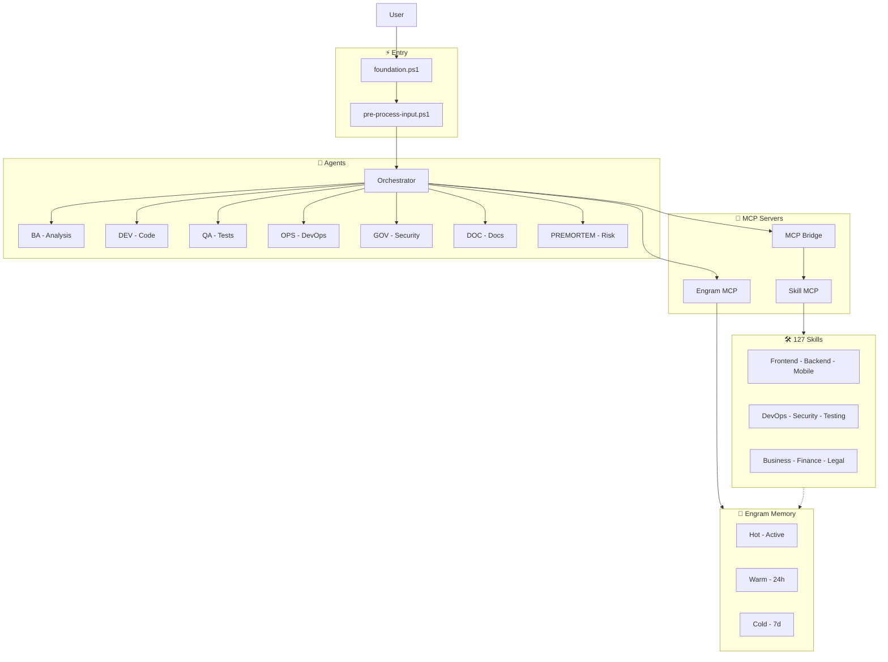
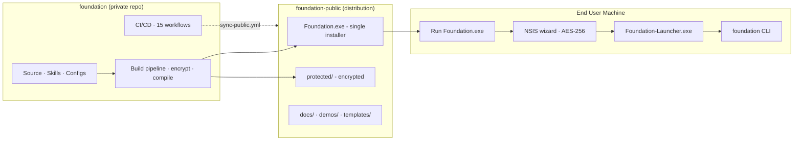

<h1 align="center">🚀 Foundation</h1>

<p align="center">
  <strong>AI-powered development stack · 129 specialized skills · 30 autonomous agents</strong><br>
  <em>🔒 100% local · 🧠 Persistent memory · ⚡ No vendor lock-in · ✅ Production ready</em>
</p>

<p align="center">
  
  
  
  
  
  
  
</p>

<p align="center">
  <a href="https://github.com/EmmanuelOrtiz87/foundation-public">📦 foundation-public</a>
  &nbsp;·&nbsp;
  <a href="docs/getting-started/README.md">📚 Getting Started</a>
  &nbsp;·&nbsp;
  <a href="docs/AGENTS.md">🤖 Bootstrap</a>
  &nbsp;·&nbsp;
  <a href="CHANGELOG.md">📋 Changelog</a>
</p>

---

## What is Foundation?

Foundation is an **AI orchestrator** that turns your CLI or IDE into a full engineering team. Not a chat wrapper — it **analyzes your project**, **delegates to specialized agents**, **executes real code**, and **remembers context across sessions**.



> 👇 **See it in action**

```powershell
$ foundation implement auth with JWT
.\scripts\utilities\session-autostart.cmd   # Start a session
foundation verify                            # Validate 14 quality gates
foundation version                           # Version + skill count
foundation dashboard live                    # Open live observability dashboard

🏗️ DEV agent generating implementation...
   → src/middleware/auth.ts        JWT verification middleware
   → src/lib/jwt.ts               Token utils (sign, verify, refresh)
   → src/routes/login.ts          Login + register endpoints
   → src/lib/validators.ts        Input validation schemas

✅ QA agent running tests...
   → 8/8 tests passing
   → gitleaks: ✅ no secrets
   → coverage: 92%

🔮 PREMORTEM reviewing risks...
   → 0 high · 2 low (documented in docs/risks/)

📦 Delivered: 4 files · 8 tests · 0 issues
   → Run time: 12.4s
```

---

## Instead of... Foundation does

| ❌ Instead of | ✅ Foundation |
|--------------|--------------|
| Prompting over and over | Auto-delegates to 16 specialized agents |
| Losing context every session | Persistent memory (Engram) across days |
| Chasing dead docs | Living skills that execute real tasks |
| Vendor-dependent tools | 100% local, zero lock-in |

---

## ⚡ Quick Start (Developers)

```powershell
git clone https://github.com/EmmanuelOrtiz87/foundation.git
cd foundation

.\scripts\utilities\session-autostart.cmd   # Start a session
foundation verify                            # Validate 14 quality gates
foundation version                           # Version + skill count
```

| Method | Command | For |
|--------|---------|-----|
| 🛠️ Bootstrap | `.\scripts\foundation\bootstrap.ps1` | Developers |
| 📦 Installer | `Foundation.exe` (from [foundation-public](https://github.com/EmmanuelOrtiz87/foundation-public)) | End users |
| 🔄 Multi-PC | `.\scripts\foundation\setup-multi-machine.ps1` | Enterprise |

---

## 🏛️ Architecture

### 5-Layer Topology



### Request Flow

```
 User    foundation.ps1   Router       Agent        MCP         Skill        Mem
  │            │            │            │            │            │            │
  │───────────▶│            │            │            │            │            │  ① foundation [command]
  │            │───────────▶│            │            │            │            │  ② pre-process
  │            │◀───────────┤            │            │            │            │  ③ route to agent
  │            │            │            │            │            │            │
  │            │────────────────────────▶│            │            │            │  ④ delegate
  │            │            │            │──────────▶│            │            │  ⑤ activate MCP
  │            │            │            │            │──────────▶│            │  ⑥ execute skill
  │            │            │            │            │            │──────────▶│  ⑦ persist
  │            │            │            │            │            │◀───────────┤  ⑧ restore
  │            │            │            │            │◀───────────┤            │  ⑨ result
  │            │            │            │◀────────────┤            │            │  ⑩ output
  │            │◀─────────────────────────┤            │            │            │  ⑪ final
  │◀───────────┤            │            │            │            │            │  ⑫ response
```

---

## 🤖 Agent Ecosystem

| Agent | Role | Delegates to |
|-------|------|-------------|
| 🧭 Orchestrator | Main router | All agents below |
| 🔍 BA | Requirements & analysis | `sdd-lifecycle` (BA phase) |
| 🏗️ DEV | Code generation | `sdd-lifecycle` (DEV phase) |
| 🏛️ SAD | System design | `sdd-lifecycle` (SAD phase) |
| ✅ QA | Testing & validation | `sdd-lifecycle` (QA phase) |
| 🚀 OPS | Deployment & CI/CD | `docker-devops-skill` |
| 📖 DOC | Technical docs | `documentation-governance` |
| 🛡️ GOV | Compliance & audit | `judgment-day` |
| 🔮 PREMORTEM | Risk assessment | `premortem-skill` |
| 💰 FINANCE | Financial modeling | `finance-financial-analyst` |
| ⚖️ LEGAL | Regulatory compliance | `legal-compliance-officer` |
| 📢 MKT | Marketing & SEO | `marketing-content-writer` |
| 💼 SALES | Pipeline management | `sales-account-executive` |
| 👥 HR | Talent acquisition | `hr-talent-acquisition` |

> Sub-agents are `hidden: true` — only Orchestrator interacts with the user. Auto-delegation in `config/auto-delegation.json`.

---

## 🗂️ Distribution Model



---

## ✅ Project Status

| Gate | Result |
|------|--------|
| ⚙️ Configuration | ✅ 3/3 |
| 🛠️ Skills | ✅ 129 validated |
| 🧪 Tests | ✅ 422 passing (442 total) |
| 🔗 Hooks | ✅ 2/2 |
| 📁 Structure | ✅ 7/7 |
| **Total** | **✅ 14/14 — Production Ready** |

---

## 🛠️ Development

| Action | Command |
|--------|---------|
| Build installer | `pwsh -File build/create-installer.ps1` |
| Run all tests | `Invoke-Pester tests/ -Output Detailed` |
| Run unit tests | `Invoke-Pester tests/unit/ -Output Detailed` |
| Run integration | `Invoke-Pester tests/integration/ -Output Detailed` |
| Security audit | `.\scripts\security\audit.ps1` |
| Quality gates | `foundation verify` or `foundation judgment-day` |

See [build/README.md](build/README.md) for the full build pipeline.

---

## 📚 Key Documentation

| Resource | Description |
|----------|-------------|
| [AGENTS.md](docs/AGENTS.md) | Canonical bootstrap (tool-agnostic) |
| [Architecture](docs/architecture/README.md) | System design & decisions |
| [Build Pipeline](build/README.md) | Encrypt, compile, distribute |
| [Skill Catalog](docs/reference/SKILL-ORGANIZATION.md) | All 127 skills |
| [Contributing](CONTRIBUTING.md) | How to contribute |
| [Changelog](CHANGELOG.md) | Version history |

---

<p align="center">
  <strong>🚀 Foundation v2.14.0</strong><br>
  <em>🔒 Local-First · 🛡️ Total Privacy · ⚡ Production Ready</em><br>
  <sub>
    <a href="https://github.com/EmmanuelOrtiz87/foundation">Private repo</a>
    ·
    <a href="https://github.com/EmmanuelOrtiz87/foundation-public">Public distribution</a>
  </sub>
</p>
