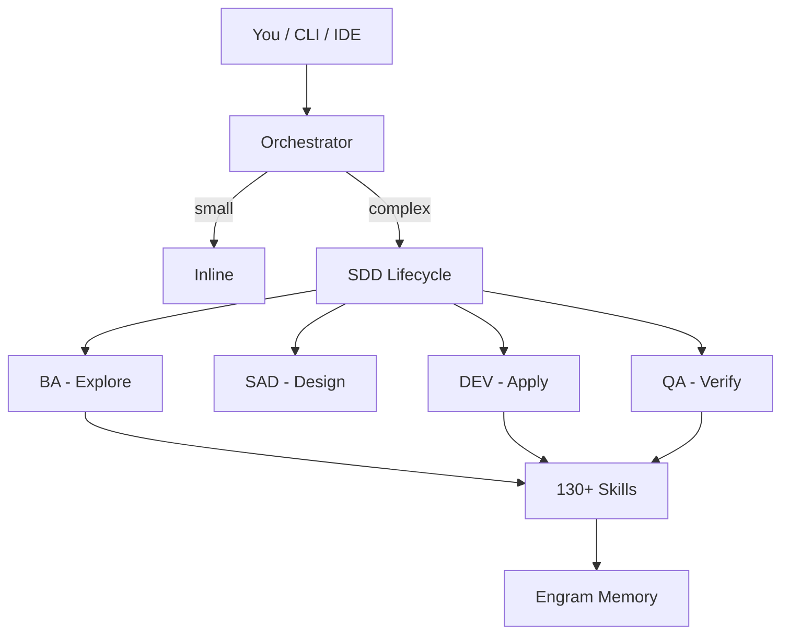

<h1 align="center">Gentle-Vanguard</h1>

<p align="center">
  <strong>AI-powered development orchestrator · 18 specialized agents · 130+ skills</strong><br>
  <em>100% local · Persistent memory · No vendor lock-in · Production ready</em>
</p>

<p align="center">
  
  
  
  
  
</p>

Born from a simple observation: AI-assisted coding works, but without structure it's chaotic. Gentle-Vanguard gives you an orchestration layer that routes tasks to specialized agents, enforces standards, tracks every token, and remembers what you did last session.

---

## What It Solves

| Problem | How It Works |
|---------|-------------|
| AI gives inconsistent code quality | 7D validation gates catch bad code before commit |
| No memory between sessions | Engram persists decisions, bugs, and patterns across sessions |
| Random model selection wastes tokens | Cost-aware router picks the cheapest capable model, with 30K token/day budget |
| No governance in AI workflows | SDD enforcement, judgment-day adversarial review, pre-commit hooks |
| Disconnected AI sessions | Session lifecycle tracks context across dispatches |
| No visibility into AI costs | Dashboard with token trends, per-agent costs, ROI analysis |

## Architecture



## Key Features

- **18 Specialized Agents** — BA, SAD, DEV, QA, OPS, GOV, DOC, PREMORTEM, plus business roles (MKT, SALES, FINANCE, HR, LEGAL)
- **130+ On-Demand Skills** — Angular, React, Next.js, Go, Django, Python, TypeScript, Docker, K8s, Playwright, Security, API Design — zero memory until triggered
- **Persistent Engram Memory** — Cross-session context, conflict detection, auto-reconciliation
- **Cost-Aware Model Router** — 4 providers, 12 models, automatic cheapest-available routing
- **Governance-First** — SDD lifecycle, 7D validation, judgment-day review, 15 CI/CD workflows
- **100% Local-First** — No required external services. Optional cloud AI integration.
- **Cross-Platform** — Windows, macOS, Linux. PowerShell 7+ and Bash.
- **CLI** — 50+ subcommands: `dispatch`, `audit`, `review`, `judgment-day`, `dashboard`, `benchmark`

## Quick Install

### Windows — One-Click

[Download Gentle-Vanguard.exe](Gentle-Vanguard.exe) — NSIS installer, AES-256 encrypted.

```powershell
# Run as Administrator, then verify:
gv health
```

### Any Platform — Git Clone

```powershell
git clone https://github.com/EmmanuelOrtiz87/gentle-vanguard-public.git
cd gentle-vanguard-public
pwsh -File scripts/bootstrap.ps1
```

## Requirements

- Windows 10/11, macOS 13+, or Linux (Ubuntu 22.04+)
- PowerShell 7+, Git 2.30+
- 4 GB RAM minimum (8 GB recommended)

## Documentation

| Resource | Link |
|----------|------|
| Getting Started | [docs/getting-started/](docs/getting-started/) |
| Installation Guide | [INSTALLATION.md](INSTALLATION.md) |
| Architecture | [docs/architecture/README.md](docs/architecture/README.md) |
| Full Index | [docs/](docs/) |

## Security

AES-256 encryption for secrets, API keys, and sensitive configs. See [SECURITY.md](SECURITY.md).

## License

[MIT](LICENSE)

---

<p align="center">
  <strong>Gentle-Vanguard v2.16.0</strong><br>
  <em>Local-First · Total Privacy · Production Ready</em>
</p>
