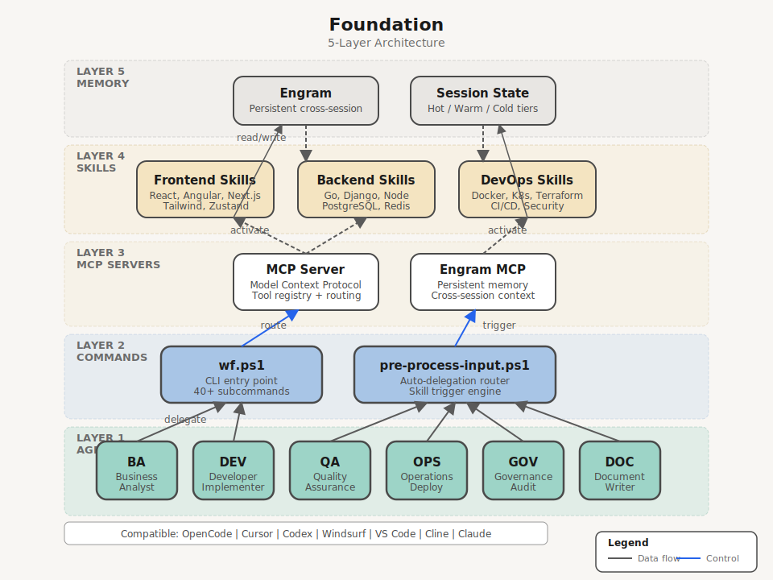

<h1 align="center">Workspace Foundation</h1>

<p align="center">
  <strong>The definitive AI-first development stack</strong><br>
  <em>Local-first. Privacy-first. 125+ specialized skills. Zero external dependencies.</em>
</p>

<p align="center">
  
  
  
  
  
  
</p>

---

## Quick Start

```powershell
# Start a session
.\scripts\utilities\session-autostart.cmd

# Verify all 14 quality gates
wf verify

# Show version + skill count
wf version

# Available commands
wf start-session | wf dashboard | wf benchmark | wf judgment-day
```

| # | Method | Command | Result |
|---|--------|---------|--------|
| 1 | **Installer (.exe)** | Download `Foundation-Setup.exe` from `dist/` | Full encrypted stack (AES-256), 125+ skills, orchestration |
| 2 | **Bootstrap** | `.\scripts\foundation\bootstrap.ps1` | Full local dev environment |
| 3 | **Multi-PC** | `.\scripts\foundation\setup-multi-machine.ps1` | Replicate on another machine |

---

## Architecture



### Data Flow

```
User Task
  -> wf.ps1 (CLI entry)
    -> pre-process-input.ps1 (auto-delegation routing)
      -> Agent (BA|DEV|QA|OPS|GOV|DOC|SAD)
        -> MCP Server (skill activation)
          -> Skill execution
            -> Engram (read/write persistent memory)
              <- Result returned to user
```

### 5 Layers

| Layer | Role | Components | Config |
|-------|------|-----------|--------|
| **1. Agents** | Task delegation | BA, DEV, QA, OPS, GOV, DOC, SAD | `config/auto-delegation.json` |
| **2. Commands** | CLI entry points | `wf.ps1`, `pre-process-input.ps1` | `config/orchestrator.json` |
| **3. MCP Servers** | Protocol bridge | Model Context Protocol, Engram MCP | `skills/*/SKILL.md` |
| **4. Skills** | Specialized execution | 125+ skills (frontend, backend, DevOps, security, testing) | `config/skill-dependencies.json` |
| **5. Memory** | Persistent context | Engram (hot/warm/cold tiers, 607+ observations) | `config/engram-config.json` |

---

## Auto-Delegation

The orchestrator routes your request to the right agent automatically:

| You Say | Agent | Skill |
|---------|-------|-------|
| "Implement login with React" | DEV | `react-19-skill` |
| "Generate E2E tests" | QA | `playwright-skill` |
| "Audit security" | GOV | `judgment-day` |
| "Deploy to production" | OPS | `docker-devops-skill` |
| "Document the API" | DOC | `documentation-governance` |
| "Analyze business requirements" | BA | `business` |
| "Review code quality" | SAD | `code-review-orchestrator-skill` |

---

## Skill Catalog

| Category | Count | Key Skills |
|----------|-------|-----------|
| Frontend | 15 | `react-19-skill`, `angular-spa-skill`, `nextjs-15-skill`, `tailwind-4-skill`, `zustand-5-skill` |
| Backend | 12 | `golang-api-skill`, `django-drf-skill`, `api-design-skill`, `database-relational-skill` |
| Mobile | 8 | `flutter-skill`, `android-kotlin-skill`, `ios-swift-development`, `react-native-skill` |
| Security & Governance | 18 | `security-skill`, `judgment-day`, `architecture-governance`, `documentation-governance` |
| Testing | 12 | `testing-skill`, `playwright-skill`, `pytest-skill`, `testing-strategy-skill` |
| Visualization | 3 | `fireworks-tech-graph`, `visual-content-skill`, `cognitive-doc-design` |
| DevOps | 6 | `docker-devops-skill`, `terraform-skill`, `ci-cd-pipeline-skill` |

> Full catalog: `docs/reference/SKILL-ORGANIZATION.md` or `wf.ps1 skills`

---

## CI/CD Pipeline (14 Workflows)

| Workflow | Purpose | Trigger |
|----------|---------|---------|
| `foundation-quality-gate.yml` | Quality gates on PRs | Every PR |
| `test-suite.yml` | 28 tests (4 categories) | Every PR/push |
| `ps-lint.yml` | PSScriptAnalyzer lint | Every PR |
| `sdd-gate.yml` | Block PRs without SDD | Every PR |
| `script-governance.yml` | Script compliance | Every PR |
| `owasp-scan.yml` | Security scanning | Weekly (Sun) |
| `codeql-analysis.yml` | CodeQL analysis | Weekly (Mon) |
| `autonomous-validation.yml` | Full validation suite | Weekly (Mon) |
| `dashboard-auto-refresh.yml` | Metrics dashboard | Daily 07:00 UTC |
| `monthly-management-report.yml` | Executive report | Monthly |
| `dependency-backup.yml` | Dependency backup | Weekly (Sun) |
| `release.yml` | Release management | On tag |
| `labeler.yml` | Auto-label PRs | Every PR |
| `workflow-lint.yml` | Workflow syntax validation | On `.github/` change |

> Branching model: `develop` for active work, `main` for releases only.

---

## Session Management

| Command | Purpose |
|---------|---------|
| `wf start-session` | Initialize tracked session with Engram |
| `wf end-session` | Close session and save summary |
| `wf dashboard` | Open HTML metrics dashboard |
| `wf benchmark` | SLO benchmark of key commands |
| `wf judgment-day` | Full QA gate (14 checks) |
| `wf skills` | List available skills |
| `wf version` | Show version + skill count |

Token budget guardRuns automatically within sessions, alerting at 80%/90%/95% thresholds.

---

## Project Structure

```
foundation/
  .agents/                    Agent configurations
  .engram/                    Persistent memory store
  .session/                   Session state and metrics
  bin/                        CLI tools (gf.ps1)
  build/                      NSIS installer definition
  config/                     All configuration files
    orchestrator.json           Main orchestrator config
    auto-delegation.json        Agent routing and triggers
    session-autostart.config.json  Pipeline steps
    security-policy.json         Auth requirements
    owner-auth.json             Owner authentication (encrypted)
  demos/                      Demo materials
  dist/                       Built installer (Foundation-Setup.exe)
  docs/                       Documentation + architecture diagrams
    assets/                    SVG/PNG architecture diagrams
    architecture/              Architecture docs
    reference/                 Skill catalog, token tracking, plugins
    getting-started/           Onboarding guide
  hooks/                      Git hooks (lefthook config)
  keys/                       Encryption keys (master.key)
  rules/                      Normativas (coding, error handling, performance)
  scripts/
    adaptive/                  Auto-orchestration (scaling, testing, docs)
    diagnostics/               Auto-learn, diagnostics
    foundation/                Bootstrap, setup, sync-public
    git-hooks/                 Commit/PR validation
    hooks/                     Pre/post processing hooks
    project/                   Project scaffolding
    security/                  Auth, token guard, security orchestrator
    utilities/                 Core utilities (wf, session, auth, metrics)
      SESSION-MANAGEMENT/      Session lifecycle scripts
      WORKFLOW-ORCHESTRATION/  Event bus, dispatch, compact
      DEPLOYMENT/             Setup monitoring, sync to public
      PERFORMANCE-OPTIMIZATION/ Compact start, optimization
      TELEMETRY-METRICS/      Token telemetry, reports
      UTILITIES/              Response mode, auth, generation
  skills/                     125+ specialized skill definitions
  templates/                  Project templates (service, cli, frontend...)
  tests/                      28 tests (4 categories)
```

---

## Configuration

| File | Purpose |
|------|---------|
| `config/orchestrator.json` | Main orchestrator (response mode, session, features) |
| `config/auto-delegation.json` | Agent routing, profiles, keyword mappings |
| `config/session-autostart.config.json` | 11-step pipeline definition |
| `config/security-policy.json` | Auth requirements for restricted ops |
| `config/owner-auth.json` | Owner API key + security questions (encrypted) |
| `config/metrics-config.json` | Metrics collection and reporting config |
| `config/behavior-prompts.json` | Agent behavior profiles |
| `CLAUDE.md` | Claude-specific instructions |
| `docs/AGENTS.md` | Tool-agnostic bootstrap (canonical entry point) |

---

## Validation Status

| Gate | Result |
|------|--------|
| CONFIG | 3/3 PASS (json-syntax, auto-delegation, quality) |
| SKILLS | 1/1 PASS (125 validated) |
| TESTS | 1/1 PASS (20 unit + 10 integration) |
| HOOKS | 2/2 PASS (hook-scripts, git-hook-installed) |
| STRUCTURE | 7/7 PASS (all checks) |
| **Total** | **14/14 PASS, 0 errors, 0 warnings** |

---

## Prerequisites

| Requirement | Version | Required? | Notes |
|------------|---------|-----------|-------|
| PowerShell | 7+ | Yes | Core runtime |
| Git | 2.50+ | Yes | Version control |
| Go | 1.26+ | Optional | Specific scripts |
| Node.js | 18+ | Optional | Some tools |

---

## Defensive Patterns

All PowerShell scripts follow standardized defensive patterns documented in `scripts/DEFENSIVE-PATTERNS.md`:

- Robust repoRoot resolution via `$env:FOUNDATION_BASE_DIR` + recursive config search
- BOM-free UTF-8 encoding
- ASCII-only output (no Unicode in scripts)
- `Add-Member -Force` for PSCustomObject property assignment
- Quoted hashtable keys with hyphens
- `$ErrorActionPreference = 'Stop'` at script entry
- SHA256 integrity baselines for security-critical config

---

## Documentation

| Document | Description |
|----------|-------------|
| [AGENTS.md](docs/AGENTS.md) | Tool-agnostic bootstrap (canonical entry) |
| [Getting Started](docs/getting-started/README.md) | Setup guide |
| [Architecture](docs/architecture/README.md) | System design |
| [Skills Catalog](docs/reference/SKILL-ORGANIZATION.md) | 125+ skills reference |
| [Session Auth Flow](docs/SESSION-AUTH-FLOW.md) | Authentication documentation |
| [Token Tracking](docs/reference/REAL-TOKEN-TRACKING.md) | Token monitoring |
| [Plugin System](docs/reference/PLUGIN-ARCHITECTURE.md) | Plugin development |
| [Defensive Patterns](scripts/DEFENSIVE-PATTERNS.md) | PowerShell coding standards |
| [Changelog](CHANGELOG.md) | Version history |
| [Contributing](CONTRIBUTING.md) | How to contribute |

---

<p align="center">
  <strong>Workspace Foundation v2.9.0</strong><br>
  <em>100% Local-First | Privacy Total | Production Ready</em>
</p>