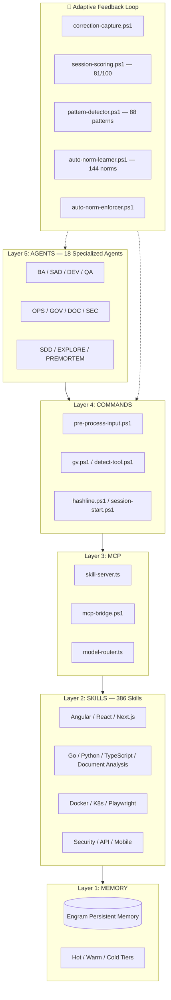
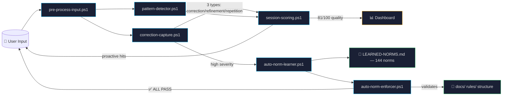
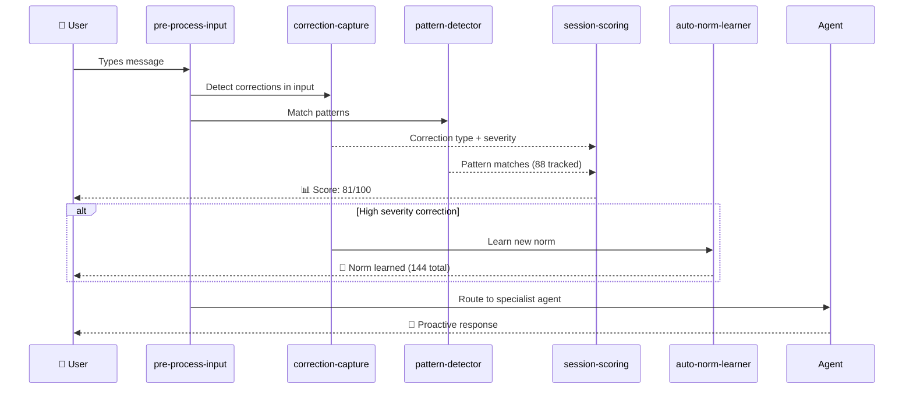

<p align="center">
  
</p>

<p align="center">
  
  
  
  
  
  
  
  
  
  
  
  
</p>

<p align="center">
  <a href="docs/AGENTS.md">Agent Bootstrap</a> &nbsp;·&nbsp;
  <a href="docs/AGENTS.md#mandatory-startup-sequence">Startup</a> &nbsp;·&nbsp;
  <a href="docs/QUICK-COMMANDS.md">Quick Commands</a> &nbsp;·&nbsp;
  <a href="rules/DELEGATION-RULES.md">Delegation</a> &nbsp;·&nbsp;
  <a href="rules/NORMATIVES.md">Normatives</a> &nbsp;·&nbsp;
  <a href="CHANGELOG.md">Changelog</a> &nbsp;·&nbsp;
  <a href="docs/diagrams/">Diagrams</a> &nbsp;·&nbsp;
  <a href="reports/dashboard.html">Dashboard</a>
</p>

<p align="center">
  <strong>AI-powered development orchestrator · 18 agents · 386 skills · 10 tool-compatible</strong><br>
  <em>Tool-agnostic · SDD Lifecycle · Hashline · Adaptive Feedback Loop · Engram Memory · Proactive Delivery</em>
</p>

> _"Building the definitive bridge between high-end software engineering and corporate strategy."_ —
> [Read the Manifesto](docs/MANIFESTO.md)

---

## 🎯 What is Gentle-Vanguard?

A full **AI orchestration layer** that gives structure, memory, and governance to AI-assisted
development. Works across any coding tool — OpenCode, Claude Code, Cline, Cursor, Windsurf, Codex,
GitHub Copilot, Continue.dev.

---

## 🏛️ Stack Architecture


```mermaid
flowchart TB
  classDef layer fill:#1a2035,stroke:#a855f7,color:#e0e0e0,stroke-width:2px
  classDef agent fill:#1a2035,stroke:#00bfff,color:#e0e0e0
  classDef cmd fill:#1a2035,stroke:#22c55e,color:#e0e0e0
  classDef skill fill:#1a2035,stroke:#f7df1e,color:#e0e0e0
  classDef mem fill:#1a2035,stroke:#ffaa00,color:#e0e0e0
  classDef adaptive fill:#1a2035,stroke:#ef4444,color:#e0e0e0,stroke-dasharray: 5 5

  subgraph L5["Layer 5: AGENTS — 18 Specialized Agents"]
    A1[BA / SAD / DEV / QA]
    A2[OPS / GOV / DOC / SEC]
    A3[SDD / EXPLORE / PREMORTEM]
  end
  subgraph L4["Layer 4: COMMANDS"]
    C1[pre-process-input.ps1]
    C2[gv.ps1 / detect-tool.ps1]
    C3[hashline.ps1 / session-start.ps1]
  end
  subgraph L3["Layer 3: MCP"]
    M1[skill-server.ts]
    M2[mcp-bridge.ps1]
    M3[model-router.ts]
  end
  subgraph L2["Layer 2: SKILLS — 386 Skills"]
    S1[Angular / React / Next.js]
    S2[Go / Python / TypeScript / Document Analysis]
    S3[Docker / K8s / Playwright]
    S4[Security / API / Mobile]
  end
  subgraph L1["Layer 1: MEMORY"]
    R1[(Engram Persistent Memory)]
    R2[Hot / Warm / Cold Tiers]
  end
  subgraph ADAPTIVE["🔄 Adaptive Feedback Loop"]
    F1[correction-capture.ps1]
    F2[session-scoring.ps1 — 81/100]
    F3[pattern-detector.ps1 — 88 patterns]
    F4[auto-norm-learner.ps1 — 144 norms]
    F5[auto-norm-enforcer.ps1]
  end

  L5 --> L4 --> L3 --> L2 --> L1
  ADAPTIVE -.-> L5
  ADAPTIVE -.-> L4
```

---

## 🧩 Component Diagram


```mermaid
flowchart LR
  classDef script fill:#1a2035,stroke:#00bfff,color:#e0e0e0
  classDef file fill:#1a2035,stroke:#22c55e,color:#e0e0e0
  classDef metric fill:#1a2035,stroke:#ffaa00,color:#e0e0e0

  UI[("👤 User Input")] --> PIP[pre-process-input.ps1]:::script
  PIP --> CC[correction-capture.ps1]:::script
  PIP --> PD[pattern-detector.ps1]:::script

  CC -->|"3 types: correction/refinement/repetition"| SS[session-scoring.ps1]:::script
  CC -->|"high severity"| ANL[auto-norm-learner.ps1]:::script

  PD --> SS
  SS -->|"81/100 quality"| DASH[📊 Dashboard]:::metric

  ANL --> NORMS[📄 LEARNED-NORMS.md — 144 norms]:::file
  ANL --> ANE[auto-norm-enforcer.ps1]:::script

  ANE -->|"validates"| DOCS[📄 docs/ rules/ structure]:::file
  ANE -->|"✅ ALL PASS"| UI

  SS -->|"proactive hits"| UI
```

---

## 🔄 Sequence Diagram — User Flow


```mermaid
sequenceDiagram
  participant U as 👤 User
  participant PIP as pre-process-input
  participant CC as correction-capture
  participant PD as pattern-detector
  participant SS as session-scoring
  participant ANL as auto-norm-learner
  participant AG as Agent

  U->>PIP: Types message
  PIP->>CC: Detect corrections in input
  PIP->>PD: Match patterns
  CC-->>SS: Correction type + severity
  PD-->>SS: Pattern matches (88 tracked)
  SS-->>U: 📊 Score: 81/100
  alt High severity correction
    CC->>ANL: Learn new norm
    ANL-->>U: 📄 Norm learned (144 total)
  end
  PIP->>AG: Route to specialist agent
  AG-->>U: 🎯 Proactive response
```

---

## 🚀 Core Capabilities

| Capability                   | Description                                                                                                               |
| ---------------------------- | ------------------------------------------------------------------------------------------------------------------------- |
| **📄 Document Analysis**     | Extrae texto de PDF/DOCX/XLSX/PPTX, detecta tecnologias, especialistas, dependencias, estima tiempos+costos USD           |
| **🤖 18 Specialized Agents** | Each with narrow role, model profile, enforcement rules                                                                   |
| **📚 386 On-Demand Skills**  | Angular, React, Next.js, Go, Django, Python, TypeScript, Docker, K8s, Playwright, Security, API Design, Document Analysis |
| **💾 Engram Memory**         | Persistent memory — decisions, bugs, and patterns across sessions with hot/warm/cold tiers                                |
| **💰 Cost-Aware Router**     | Fast/cheap, strong-reasoning, or strong-coding profiles per agent                                                         |
| **📋 SDD Lifecycle**         | BA explore → SAD design → DEV implement → QA verify                                                                       |
| **🛡️ Governance**            | 7D validation, judgment-day adversarial review, pre-commit hooks, 34 CI/CD workflows                                      |
| **📊 Session Management**    | 10-phase autostart, orphan cleanup, token budget tracking                                                                 |
| **🔒 Proactive Security**    | AES-256 encryption, TruffleHog scanning, Gitleaks integration                                                             |
| **🎯 Auto-Delegation**       | ML-based routing with 80%+ direct, 60%+ confirmation threshold                                                            |
| **🧪 Fine-Tuning**           | LoRA adapters for BA and DEV agents                                                                                       |
| **🔄 Adaptive Profiles**     | Auto-detect tool and adjust config per tool capabilities                                                                  |

---

## 🔄 Adaptive Feedback Loop

New in **v3.3.1** — a self-improving system that learns from every interaction:

### Fase 1: auto-norm-learner

Detects high-severity corrections and **automatically extracts norms**. Uses ForceBaseline to
prevent duplicate norms. Currently maintains **144 learned norms** in
`rules/adaptive/LEARNED-NORMS.md`.

- `scripts/adaptive/auto-norm-learner.ps1`
- `rules/adaptive/LEARNED-NORMS.md` — 144 entries
- Trigger: high severity correction detected

### Fase 2: session-scoring

Scores each session on quality, correction frequency, and proactive hit rate. Runs on session close.

- **Current score: 81/100**
- Metrics per type: corrections, refinements, repetitions
- Tracks proactive suggestion accuracy
- `scripts/adaptive/session-scoring.ps1`

### Fase 3: correction-capture

Captures corrections, refinements, and repetitions from user input in real-time. Classifies each
into one of 3 types:

| Type          | Description                    | Hot Trigger       |
| ------------- | ------------------------------ | ----------------- |
| 🔧 Correction | Fixes an error in agent output | Auto-learns norm  |
| ✨ Refinement | Improves quality without error | Session scoring   |
| 🔁 Repetition | User re-explains same concept  | Pattern detection |

- `scripts/adaptive/correction-capture.ps1`

### Fase 4: pattern-detector + auto-norm-enforcer

- **pattern-detector**: 88 patterns tracked, identifies recurring issues across sessions
- **auto-norm-enforcer**: Validates docs and rules structure against learned norms on session
  start/close — **✅ ALL PASS**

---

## 🐛 Bugs Fixed (v3.3.x Cycle)

| #   | Bug                                    | Root Cause                                                     | Fix                                                      |
| --- | -------------------------------------- | -------------------------------------------------------------- | -------------------------------------------------------- |
| 1   | `$Input` auto variable conflict        | PowerShell `$Input` automatic variable shadowed parameter      | Renamed to `$InputText`                                  |
| 2   | `$($Correction.Severity})` extra brace | Mismatched closing brace in string interpolation               | Added missing `(` → `$($Correction.Severity)`            |
| 3   | Proactive suggestions invisible        | Generated but never displayed to user                          | Added output pipeline to user prompt                     |
| 4   | auto-norm-enforcer parser broken       | Searched nonexistent section `[NORM]` instead of `##` headings | Fixed regex to match markdown headings                   |
| 5   | token-metrics-store corrupted DB crash | Null metric types crashed JSON parsing                         | Added `$null` guards and fallback default values         |
| 6   | engram.db hash mismatch                | Power outage during write caused checksum failure              | Added repair routine with `--repair` on checksum failure |

---

## 🧠 Engram Persistent Memory

Engram provides structured long-term memory across coding sessions:

- **Hot tier**: Current session context
- **Warm tier**: Recent sessions (24h, 90% recall)
- **Cold tier**: Historical data (7d+, 70% recall)
- **Manual saves**: Architecture decisions, bug fixes, patterns
- **Integrity**: Checksum-verified with automatic repair

```powershell
# Query past learnings
mem_search "architecture decisions"

# Save important context
mem_save --title "Auth pattern" --type architecture
```

---

## ✅ Validation & Health

| Check                                                                    | Status        |
| ------------------------------------------------------------------------ | ------------- |
| 🔄 validate-stack (pre-process-input, session pipeline, hashline, hooks) | ✅ ALL PASS   |
| 🧠 engram integrity (hash, repair, reindex)                              | ✅ ALL PASS   |
| 📄 auto-norm-enforcer (144 norms validated)                              | ✅ ALL PASS   |
| 📄 norms-registry.json (144 norms, versioned schema)                     | ✅ SYNCED     |
| 📊 session-scoring operational                                           | ✅ 81/100     |
| 🔍 pattern-detector (88 patterns)                                        | ✅ ACTIVE     |
| 🛡️ CI/CD (12 consolidated workflows, reusable)                           | ✅ PASSING    |
| 🐳 Docker Compose (5 services, full stack)                               | ✅ CONFIGURED |
| 📝 Structured logging (JSONL, auto-rotate)                               | ✅ ACTIVE     |
| 🧩 Adapters consolidated (3→1 TypeScript)                                | ✅ COMPLETED  |
| 📄 Document Analysis Skill (sidecar Python + conectores Jira/Confluence) | ✅ ACTIVE     |

---

## 📦 Latest Release: v3.3.2

**Highlights:**

- 🌐 **Dashboard i18n** — 3 idiomas (en/es/pt-BR), 14 métricas localizadas
- 🚨 **Alertas automáticos** — 8 reglas en dashboard-alerts.json
- 🛡️ **Maintenance Watchtower** — 60 checks en 11 componentes, 6 modos
- 📊 **Info Popups** — métricas con descripción animada (fade-in + scale)
- 🔧 **Dashboard server refactor** — WebSocket + REST API resiliente
- 🧩 **Dashboard utilities** — scripts de ciclo de vida con puertos dinámicos
- 🐛 **Pre-process pipeline** — trace system, debug logging, health integration
- 📄 **SECURITY.md** + .clinerules + .cursorrules — tool configs oficiales
- 📚 **Nuevas normativas**: NORMATIVA-PNPM-SECURITY, NORMATIVAS-PERFORMANCE
- 🗂️ **norms-registry.json** — 144 normas con schema versionado

---

## ⚡ Quick Start

```powershell
# Clone
git clone https://github.com/EmmanuelOrtiz87/gentle-vanguard.git
cd gentle-vanguard

# Run the bootstrap
./gentle-vanguard.ps1 -Dashboard

# Or use session start pipeline
pwsh -NoProfile -File scripts/utilities/session-start-optimized.ps1
```

---

## 📖 Documentation

| Resource         | Path                             |
| ---------------- | -------------------------------- |
| Agent Bootstrap  | `docs/AGENTS.md`                 |
| Quick Commands   | `docs/QUICK-COMMANDS.md`         |
| Delegation Rules | `rules/DELEGATION-RULES.md`      |
| Normatives Index | `rules/NORMATIVES.md`            |
| Architecture     | `docs/reference/ARCHITECTURE.md` |
| Getting Started  | `docs/getting-started/README.md` |
| Changelog        | `CHANGELOG.md`                   |
| Roadmap          | `docs/ROADMAP.md`                |
| Stack Status     | `docs/STACK-STATUS-REPORT.md`    |
| Adapters         | `adapters/index.ts`              |
| Research         | `research/rlhf-dataset-search/`  |

### 📐 Diagrams

| Diagram           | File                                       |
| ----------------- | ------------------------------------------ |
| Call Graph        | `docs/diagrams/call-graph.mmd`             |
| Data Flow         | `docs/diagrams/data-flow.mmd`              |
| Module Dependency | `docs/diagrams/module-dependency.mmd`      |
| Document Analysis | `skills/document-analysis-skill/SKILL.md`  |
| Document Pipeline | `docs/diagrams/document-analysis-flow.mmd` |

---

## 📁 Project Structure

```
gentle-vanguard/
├── apps/                   # Applications (web-dashboard, API)
├── build/                  # Build artifacts
├── config/                 # Centralized configuration
├── docs/                   # Documentation
│   ├── diagrams/           # Mermaid architecture diagrams
│   ├── marketing/          # Social media & launch content
│   ├── reference/          # Technical reference
│   └── getting-started/    # Onboarding guides
├── hooks/                  # Custom hooks
├── rules/                  # Normatives and standards (60+ rules)
│   └── adaptive/           # Auto-learned norms (144) + norms-registry.json
├── scripts/
│   ├── adaptive/           # Adaptive feedback loop (5 scripts + sync-norms-registry)
│   ├── common/             # Shared modules (Logger.psm1)
│   ├── core/               # Core bootstrap
│   ├── utilities/          # Utility scripts
│   ├── security/           # Security tools
│   └── monitoring/         # Monitoring and metrics
├── adapters/               # Tool adapters (consolidated TypeScript: antigravity, codex, windsurf)
├── research/               # RLHF dataset search scripts
│   └── document-analysis-skill/ # Document Analysis: sidecar Python + conectores Jira/Confluence
├── skills/                 # MCP skills (386)
├── reports/                # Generated dashboards & reports
├── docker-compose.yml      # Full stack (5 services)
├── tests/                  # Unit + integration tests
```

---

## 🛡️ Normatives & Standards

Governed by [60+ normatives](rules/NORMATIVES.md):

| Area              | Standard                                    |
| ----------------- | ------------------------------------------- |
| Architecture      | NORMATIVAS-ARCHITECTURE                     |
| Code              | NORMATIVAS-CODIGO                           |
| Configuration     | NORMATIVAS-CONFIG + CONFIG-SAFETY           |
| Documentation     | NORMATIVAS-DOCS                             |
| Document Analysis | SKILL.md en skills/document-analysis-skill/ |
| Security          | AI-SAFETY, SOC2, GDPR                       |
| DevOps            | NORMATIVAS-DEVOPS                           |
| Performance       | NORMATIVAS-PERFORMANCE                      |
| Error Handling    | NORMATIVAS-ERROR-HANDLING                   |
| Enforcement       | NORMATIVAS-ENFORCEMENT                      |
| Session           | NORMATIVAS-SESSION                          |

Enforcement: pre-response hook (every turn) → pre-commit hooks (Lefthook) → CI/CD (12 reusable
workflows) → adaptive enforcement (session start/close).

---

## 🌐 Social & Community

- **GitHub (Private)**:
  [github.com/EmmanuelOrtiz87/gentle-vanguard](https://github.com/EmmanuelOrtiz87/gentle-vanguard)
- **GitHub (Public)**:
  [github.com/EmmanuelOrtiz87/gentle-vanguard-public](https://github.com/EmmanuelOrtiz87/gentle-vanguard-public)
- **Social Launch**: [docs/marketing/SOCIAL-MEDIA-LAUNCH.md](docs/marketing/SOCIAL-MEDIA-LAUNCH.md)

---

## 📄 License

MIT © 2026 Emmanuel Ortiz

---

<p align="center">
  <sub>Gentle-Vanguard v3.3.3 — Don't let your mellow hustle be faded.</sub>
</p>
