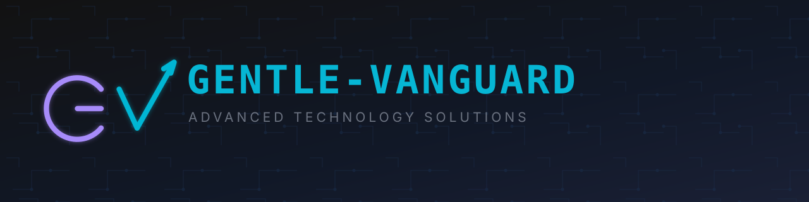

<p align="center">
  
</p>

<p align="center">
  
  
  
  
  
  
  
  
</p>

<p align="center">
  <a href="docs/agents/AGENTS.md">Agent Bootstrap</a> &nbsp;·&nbsp;
  <a href="CHANGELOG.md">Changelog</a> &nbsp;·&nbsp;
  <a href="rules/NORMATIVES.md">Normatives</a> &nbsp;·&nbsp;
  <a href="docs/operations/procedures/QUICK-COMMANDS.md">Quick Commands</a> &nbsp;·&nbsp;
  <a href="rules/NEXUS-NORMATIVA.md">Nexus DB</a>
</p>

<p align="center">
  <strong>AI-powered development orchestrator — zero-dependency, self-healing, fully autonomous</strong><br>
  <em>SDD Lifecycle · Engram Memory · Adaptive Feedback · 100 Pipeline Steps · 82 Health Checks</em>
</p>

---

## ⚡ Quick Start

```TypeScript
# Clone anywhere — no dependencies required beyond TypeScript 7+
git clone https://github.com/EmmanuelOrtiz87/gentle-vanguard.git
cd gentle-vanguard

# Auto-install (prerequisites, hooks, dashboard build)
.\scripts\setup-complete.ps1

# Run the dashboard (WS server + Vite + auto-open browser)
.\scripts\utilities\dashboard\dashboard-start.ps1
```

Works on Windows, macOS, and Linux.

---

## 🛡️ What is Gentle-Vanguard?

An **AI orchestration layer** that gives structure, memory, and governance to AI-assisted development. Tool-agnostic across OpenCode, Claude Code, Cline, Cursor, Windsurf, Codex, Copilot, Continue.dev — with **zero cloud services, zero API keys, zero external dependencies**.

The stack runs a **100-step autonomous pipeline** at session start, monitors **82 health checks** across 13 components, persists state in a **SQLite operational database** (15 tables, 10 DAOs), and powers a **real-time observability dashboard** with WebSocket push.

---

## 🏗️ Architecture

```mermaid
flowchart TB
  classDef layer fill:#1a2035,stroke:#a855f7,color:#e0e0e0,stroke-width:2px
  classDef agent fill:#1a2035,stroke:#00bfff,color:#e0e0e0
  classDef dash fill:#1a2035,stroke:#22c55e,color:#e0e0e0

  subgraph L6["Layer 6: EXECUTIVE — Autonomous Operations"]
    A1[Auto-Apply Safe · Circuit Breaker · Auto-Escalation · Session Scoring]
    A2[Dynamic Dependency Graph · AB Testing · Predictive Governor · Convergence Monitor]
  end
  subgraph L5["Layer 5: AGENTS — 18 Specialized Roles"]
    B1[BA · SAD · DEV · QA · OPS · GOV · DOC · SEC · PREMORTEM · SDD-EXPLORE]
    B2[SDD-DESIGN · SDD-APPLY · SDD-VERIFY · SESSION · OPS · PREMORTEM · GOV · DOC]
  end
  subgraph L4["Layer 4: DASHBOARD — Real-time Observability"]
    D1[7-section UI · WebSocket push / 5s · HTTP REST API]
    D2[i18n en/es/pt-BR · 14 metrics · Tracing Waterfall · Alerts · Feedback]
    D3[Nexus DB · 10 DAOs · 15 tables · WAL mode · Auto-prune]
  end
  subgraph L3["Layer 3: MCP — Model Context Protocol"]
    M1[Gateway · Bridge · Registry · Multi-language SDK]
    M2[8 pre-built templates · ts/js/py/go/rs]
  end
  subgraph L2["Layer 2: MEMORY & KNOWLEDGE"]
    K1[Engram (hot/warm/cold) · CodeGraph (1410 nodes) · Event Store]
    K2[Checkpoints · Snapshots · Knowledge Base · Findings Ledger]
  end
  subgraph L1["Layer 1: ORCHESTRATION"]
    O1[100-step pipeline · 82 health checks · Auto-healing watchdog]
    O2[SDD lifecycle · Audit · Tracing · Cloud connectors · Security orchestrator]
  end

  L6 --> L5 --> L4 --> L3 --> L2 --> L1
```

---

## ✨ Features

| Capability | Description |
|---|---|
| **Auto-Apply Safe** | Executive engine — applies safe optimizations (budget, deprecations, norms) with rollback protection |
| **Circuit Breaker API** | 5-failure → OPEN, 2-success → HALF_OPEN → CLOSED, with automatic fallback |
| **Auto-Escalation** | Escalates unresolved issues through configured channels with SLA tracking |
| **Dynamic Dependency Graph** | Real-time dependency resolution and conflict detection across the stack |
| **AB Testing Framework** | Session-scoped experiment framework with statistical significance testing |
| **Session Scoring** | Auto-compare quality scores across sessions (delegations, corrections, proactive hits) |
| **10 DAOs** | Database Repository pattern — Cache, Contract, ErrorMemory, Event, Housekeeping, Metrics, Session, Skill, Trace, MigrationRunner |
| **Cache LRU + WAL** | SHA256 response cache with TTL + automatic WAL checkpoint when >5MB |
| **Parallel Watchtower** | 82 health checks across 13 components — runs in parallel with auto-heal |
| **Session Consolidation** | Context compaction engine — token-budget-aware, auto-summarize and wipe |
| **Engram Memory** | Persistent memory across sessions with hot/warm/cold tiers and auto-repair |
| **Dashboard UI** | Real-time: 7-section view, tracing waterfall, alerts, feedback, i18n (en/es/pt-BR) |
| **Nexus Database** | SQLite operational DB (WAL mode, FK ON) — 15 tables, auto-migrate, auto-prune |
| **100 Pipeline Steps** | Session autostart pipeline with lazy/blocking phases, on-failure=continue |
| **18 Specialized Agents** | BA, SAD, DEV, QA, OPS, GOV, DOC, SEC — each with model routing |
| **SDD Lifecycle** | Explore → Design → Implement → Verify — full spec-driven development |
| **Adaptive Feedback** | Auto-learn norms from corrections, session scoring, pattern detection |
| **Governance** | 60+ normatives, pre-commit hooks, CI/CD, audit pipeline, safety layer |
| **Predictive Governor** | Anticipate load, prewarm resources, adjust token budgets proactively |
| **Zero-dependency** | Works with just TypeScript 7+ — no cloud, no API keys, no external services |

---

## 📊 Key Metrics

| Metric | Value |
|---|---|
| Test Suites | **19/19 passed** |
| Health Checks | **82/82 PASS** — 13 components |
| Pipeline Steps | **100** (blocking + lazy) |
| DAOs / Tables | **10 DAOs / 15 tables** |
| Autonomy | **100%** — zero manual intervention required |
| CodeGraph | **1,410 nodes / 1,763 edges / 133 files** |
| Dashboard APIs | **25+ REST endpoints + WebSocket** |
| i18n Locales | **3** — en, es, pt-BR |
| Uptime Recovery | **Auto-heal watchdog** — 10 restart attempts |
| DB Size | **~0.27 MB** (operational + historical) |

---

## 📈 Dashboard

Real-time LLM observability dashboard — React + TypeScript + Vite + WebSocket:

```
apps/web-dashboard/
├── server/
│   ├── websocket-server.ts    # WS push / 5s + 25+ REST endpoints
│   ├── real-data.ts           # Real metrics from .session/ traces
│   ├── database/
│   │   ├── manager.ts         # DatabaseManager singleton (SQLite WAL)
│   │   ├── metrics-writer.ts  # Time-series writer
│   │   └── repositories/      # 10 DAOs (Cache, Contract, Error, Event, etc.)
│   ├── mesh-api.ts            # Multi-repo mesh endpoints
│   ├── knowledge-api.ts       # Unified knowledge query
│   ├── mcp-gateway-api.ts     # MCP server management
│   ├── global-health-api.ts   # /api/health (7 components)
│   ├── marketplace-api.ts     # Skill marketplace
│   └── shared-state-bridge.ts # Cross-component state sync
└── src/components/
    ├── Dashboard.tsx           # 7-section main view
    ├── TracingDashboard.tsx    # Waterfall with feedback
    ├── KnowledgePanel.tsx      # Unified search (events, traces, feedback, engram)
    ├── MultiRepoView.tsx       # Cross-workspace MCP orchestration
    ├── MCPServers.tsx          # MCP registry management
    ├── TenantSelector.tsx      # Multi-tenant filter
    ├── InfoPopup.tsx           # Animated metric info (fade-in + scale)
    └── ...
```

**Start**: `.\scripts\utilities\dashboard\dashboard-start.ps1`  
**Stop**: `.\scripts\utilities\dashboard\dashboard-stop.ps1`

---

## 📋 Quick Commands

| Command | Description |
|---|---|
| `npm test` | Run all **19 test suites** |
| `npx tsx src/session-autostart.ts` | Run the **100-step session pipeline** |
| `npx tsx src/auto-apply-safe.ts --check` | Check safe optimizations pending |
| `npx tsx src/auto-apply-safe.ts --apply` | Apply safe optimizations with rollback |
| `npx tsx src/auto-apply-safe.ts --report` | Report optimization status |
| `npm run watchtower` | Run **82 health checks** |
| `npm run watchtower:health` | Health-check only mode |
| `npm run db:health` | Nexus DB health (integrity, WAL, tables) |
| `npm run db:init` | Init DB + run migrations (idempotent) |
| `npm run db:backup` | Safe online backup |
| `npm run db:prune` | Prune old data (events >30d, cache >7d) |
| `cd apps/web-dashboard && npm run build` | Build dashboard for production |
| `.\scripts\setup-complete.ps1` | Auto-install (prerequisites + hooks + build) |
| `npm run graphify -- query "<question>"` | Knowledge graph semantic search |
| `npm run graphify -- update .` | Update code graph snapshot |

Full reference: [docs/operations/procedures/QUICK-COMMANDS.md](docs/operations/procedures/QUICK-COMMANDS.md)

---

## 📚 Documentation

| Resource | Path |
|---|---|
| Agent Bootstrap | `docs/agents/AGENTS.md` |
| Quick Commands | `docs/operations/procedures/QUICK-COMMANDS.md` |
| Normatives Index | `rules/NORMATIVES.md` |
| Nexus DB Normativa | `rules/NEXUS-NORMATIVA.md` |
| Changelog | `CHANGELOG.md` |
| Dashboard Skill | `.opencode/skills/dashboard/SKILL.md` |
| Vanguards (Stack Rules) | `rules/` |

---

## 📦 Requirements

- **TypeScript 7+** — the only hard requirement
- **Node.js 18+** — optional, only for dashboard development
- **Git** — optional, only for clone and hooks

---

## 📄 License

MIT © 2026 Emmanuel Ortiz

---

<p align="center">
  <sub>Gentle-Vanguard v8.0.1 — Don't let your mellow hustle be faded.</sub>
</p>
