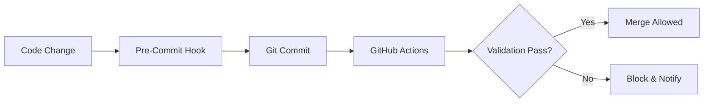

# AUTONOMOUS VALIDATION SYSTEM

## Overview
The autonomous validation system provides automated checks and balances for the Foundation workspace, ensuring code quality, documentation standards, and governance compliance.

## Components

### 1. GitHub Actions Workflow
**File:** `.github/workflows/autonomous-validation.yml`

Automated validation triggered on:
- Push to `develop` or `main` branches
- Pull request events
- Scheduled runs (daily at 2 AM)

**Checks performed:**
- PowerShell script syntax validation
- JSON configuration validation  
- Markdown documentation standards (accents, code blocks, emojis)
- Git hooks functionality
- Directory structure validation

### 2. Pre-Commit Hooks (Lefthook)
**Config:** `lefthook.yml`

Local validation before each commit:
- Trailing whitespace removal
- JSON syntax check
- Markdown lint (accent checking)
- PowerShell syntax validation

### 3. Comprehensive Validation Script
**File:** `scripts/utilities/WORKFLOW-ORCHESTRATION/comprehensive-validation.ps1`

Full system validation covering:
- All PowerShell scripts syntax
- JSON configuration files
- Documentation completeness and standards
- Directory structure
- Hooks configuration
- Integration points (Git, GitHub Actions)
- System definitions (opencode.json)

**Usage:**
```powershell
.\scripts\utilities\WORKFLOW-ORCHESTRATION\comprehensive-validation.ps1 -Verbose
```

### 4. WF CLI Integration
**File:** `scripts/utilities/WORKFLOW-ORCHESTRATION/wf.ps1`

Unified CLI for all validation commands:
- `wf.ps1 verify` - Quick stack verification
- `wf.ps1 audit` - Generate audit document
- `wf.ps1 diagnose` - Full system diagnostics
- `wf.ps1 health` - Check system health

## Validation Pipeline



## Standards Enforced

### Documentation (Markdown)
- ✅ Proper Spanish accents (automatización, configuración, revisión, activación)
- ✅ Code blocks with language specification (```powershell, ```bash, ```json)
- ✅ UTF-8 encoding without BOM
- ✅ Emojis for visual scanning
- ✅ Tables for structured data
- ✅ Blank lines before/after headers and code blocks

### Configuration (JSON)
- ✅ Valid JSON syntax
- ✅ Required fields present
- ✅ No sensitive data
- ✅ UTF-8 encoding without BOM

### Scripts (PowerShell)
- ✅ Valid syntax
- ✅ No emojis (CLI compatibility)
- ✅ Consistent indentation
- ✅ UTF-8 encoding without BOM

## Lessons Learned (2026-04-15 Incident)

### Incident: Hooks Removal
During cleanup operation, pre-commit and commit-msg hooks were accidentally removed.

**Root Cause:**
- Aggressive cleanup script without exclusions
- No protection for critical infrastructure files

**Prevention:**
- Added infrastructure protection rules in cleanup scripts
- Hooks directory and config files now protected
- Validation script checks hook configuration
- Recovery procedure documented in LESSONS-LEARNED-HOOKS-INCIDENT.md

## Autonomous Decision Making

The system operates under these principles:
1. **Fail Fast** - Stop on critical errors
2. **Warn Liberally** - Non-blocking warnings for improvements
3. **Self-Heal** - Auto-repair when possible (via `wf.ps1 verify`)
4. **Notify** - Alert via GitHub Actions and session notifications

## Maintenance

### Daily
- Review validation reports in `.session/reports/`
- Check telemetry dashboard: `tools/telemetry-dashboard.ps1`

### Weekly
- Run `wf.ps1 audit` for comprehensive review
- Update documentation governance rules if needed
- Review and archive old validation reports

### On Incident
- Check `docs/LESSONS-LEARNED-*.md` for similar cases
- Run `wf.ps1 diagnose -JSON` for full diagnostics
- Document new lessons learned
- Update validation scripts if needed

---
**Version:** 2.0 (Updated 2026-05-02)  
**Maintained by:** Foundation Orchestrator  
**References:**
- [LESSONS-LEARNED-HOOKS-INCIDENT.md](LESSONS-LEARNED-HOOKS-INCIDENT.md)
- [CONFIGURATION-VALIDATION-CHECKLIST.md](CONFIGURATION-VALIDATION-CHECKLIST.md)
- [NORMATIVAS-ORQUESTADOR.md](reference/NORMATIVAS-ORQUESTADOR.md)
