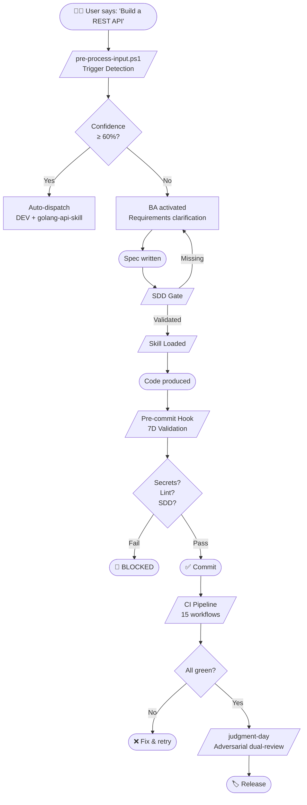

# 🏛️ Gentle-Vanguard — AI Development Stack

<p align="center">
  
  
  
  
  
  
  
</p>

<p align="center">
  <b>A governance-first AI development stack — 29 agents, 132 on-demand skills, zero compromise.</b>
</p>

---

> 🚀 **What is Gentle-Vanguard?** Not a library. Not a framework. It's a **complete AI operating system for software delivery** — where every agent follows rules, every commit is validated, and every token is accounted for.

---

## 🔥 Quick Start — 3 Commands

```powershell
# 1️⃣ Clone
git clone https://github.com/EmmanuelOrtiz87/gentle-vanguard-public.git
cd gentle-vanguard

# 2️⃣ Bootstrap (installs hooks, verifies deps, configures your environment)
.\scripts\utilities\WORKFLOW-ORCHESTRATION\gentle-vanguard.ps1 start-session

# 3️⃣ Start working — tell the AI what to build
```

> ✅ Steps 2-3 are **fully automatic**. You only clone, bootstrap, and work.

---

## 🧭 Automatic vs. Manual — What the Stack Does for You

### ⚡ Automatic (zero user effort)

| What | How | Guardrails |
|------|-----|------------|
| **Session tracking** | Auto-starts on `gentle-vanguard.ps1 start-session` | Logs every dispatch, token, and event |
| **Trigger routing** | `pre-process-input.ps1` parses your input → dispatches the right agent + skill | Falls back to BA if confidence < 60% |
| **Pre-commit validation** | Lefthook runs 7D checks before every `git commit` | Blocks on secrets, lint errors, SDD violations |
| **Token budget guard** | 30K tokens/day cap with 70% soft / 90% hard thresholds | Agents cannot exceed budget |
| **Engram memory** | Saves observations across sessions automatically | Retrievable via `mem_search` |
| **Telemetry + event bus** | 10 standard events with governance gate + distributed tracing | Audit trail for every action |
| **Sync-drift detection** | `gv sync-drift` detects workspace inconsistencies | Reports before release |
| **CI/CD pipeline** | 15 GitHub Actions workflows run on every push | Quality gate, PSScriptAnalyzer, OWASP, SDD gate |

### 🔧 Manual (you decide when)

| What | Command | When to Use |
|------|---------|-------------|
| Start a session | `gv start-session` | Beginning of any work block |
| Request an agent | `gv dispatch DEV,QA "add tests for auth module"` | Need specialized AI assistance |
| Full quality gate | `gv judgment-day` | Before any release or major merge |
| Generate dashboard | `gv dashboard` | Weekly review, exec reporting |
| Adversarial review | `gv review --all` | Before shipping critical changes |
| SLO benchmark | `gv benchmark` | Performance regression check |
| Version info | `gv version` | Check stack health and skills count |

---

## 🏗️ Architecture

```
┌─────────────────────────────────────────────────────────────────┐
│                    🤖 AI AGENT LAYER                            │
│  OpenCode │ Claude Code │ Cursor │ Windsurf │ Copilot │ Codex   │
│  ┌──────────────────────────────────────────────────────────┐   │
│  │  BA · SAD · DEV · QA · OPS · GOV · DOC · PREMORTEM      │   │
│  │  MKT · SALES · FINANCE · HR · LEGAL · BUS-TELE           │   │
│  │  SESSION · SCRIPT-GOV · REPORT · PR-REVIEW · RELEASE     │   │
│  │  SESSION-CLOSE · DAILY · ORCHESTRATOR                    │   │
│  │  7× GITFLOW (BRANCH · PR · HOOKS · MERGE · WORKFLOW      │   │
│  │             COMMIT · CONFLICT)                            │   │
│  └──────────────────────────────────────────────────────────┘   │
└──────────────────────────────┬──────────────────────────────────┘
                               │ Auto-delegation via config/auto-delegation.json
┌──────────────────────────────▼──────────────────────────────────┐
│                    ⚙️ ORCHESTRATION LAYER                        │
│  ┌──────────────────────────────────────────────────────────┐   │
│  │  gv.ps1 CLI (40+ commands)                              │   │
│  │  pre-process-input.ps1 (trigger detection + routing)     │   │
│  │  session-autostart.cmd (platform bootstrap)              │   │
│  │  Artifact naming · File locking · Concurrency limits     │   │
│  └──────────────────────────────────────────────────────────┘   │
└──────────────────────────────┬──────────────────────────────────┘
                               │ On-demand loading
┌──────────────────────────────▼──────────────────────────────────┐
│                    🧩 SKILL LAYER                                │
│  ┌──────────────────────────────────────────────────────────┐   │
│  │  132 on-demand skills activated by keyword               │   │
│  │  Angular · React · Next.js · Go · Django · Python        │   │
│  │  TypeScript · Zod · Zustand · Tailwind · AI SDK · MCP    │   │
│  │  Docker · Kubernetes · Playwright · Pytest · Security    │   │
│  │  API Design · Database · Session · Release · GitFlow     │   │
│  └──────────────────────────────────────────────────────────┘   │
└──────────────────────────────┬──────────────────────────────────┘
                               │ Enforced by
┌──────────────────────────────▼──────────────────────────────────┐
│                    📋 GOVERNANCE LAYER                           │
│  ┌──────────────────────────────────────────────────────────┐   │
│  │  SDD enforcement (no spec, no code)                      │   │
│  │  Token budget guard (30K/day)                            │   │
│  │  7D validation (Security · Quality · Architecture ·      │   │
│  │    Testing · Docs · API · GitFlow)                       │   │
│  │  Judgment day protocol (adversarial dual-review)         │   │
│  │  Pre-commit hooks · Pre-push hooks · Commit-msg lint     │   │
│  └──────────────────────────────────────────────────────────┘   │
└──────────────────────────────┬──────────────────────────────────┘
                               │ Runs on
┌──────────────────────────────▼──────────────────────────────────┐
│                    🖥️ INFRASTRUCTURE LAYER                       │
│  ┌──────────────────────────────────────────────────────────┐   │
│  │  Windows · Linux · macOS                                 │   │
│  │  PowerShell 7+ · Bash                                    │   │
│  │  Docker · Kubernetes                                     │   │
│  │  15 GitHub Actions workflows                             │   │
│  │  Project templates (Web API, SPA, Microservices, etc.)   │   │
│  └──────────────────────────────────────────────────────────┘   │
└─────────────────────────────────────────────────────────────────┘
```

---

## 🤖 The 29 AI Agents

| Agent | Code | Temperature | Role | Hallucination Guard |
|-------|------|-------------|------|---------------------|
| **Orchestrator** | `ORCHESTRATOR` | — | Routes tasks, manages context, coordinates all agents | — |
| **Business Analyst** | `BA` | 0.7 | Explores requirements, writes specs, asks clarifying questions | Low |
| **System Architect** | `SAD` | 0.3 | Designs architecture, defines API contracts, documents tradeoffs | Medium |
| **Developer** | `DEV` | 0.15 | Writes code, implements features, refactors | High |
| **Quality Assurance** | `QA` | 0.1 | Writes tests, validates quality, runs gates | Critical |
| **Operations** | `OPS` | 0.1 | Deploys, manages CI/CD, infrastructure | Critical |
| **Governance** | `GOV` | 0.1 | Enforces policies, security, compliance, audit | Critical |
| **Documentation** | `DOC` | 0.4 | Writes guides, READMEs, runbooks, reports | Low |
| **Marketing** | `MKT` | 0.5 | Content strategy, SEO, blog posts, branding | Low |
| **Sales** | `SALES` | 0.3 | Account plans, deal proposals, pipeline management | Medium |
| **Finance** | `FINANCE` | 0.15 | Financial models, budgets, forecasts, ROI analysis | High |
| **HR** | `HR` | 0.4 | Job descriptions, hiring rubrics, onboarding | Medium |
| **Legal** | `LEGAL` | 0.1 | Regulatory compliance, GDPR, HIPAA, policy | Critical |
| **Business Telemetry** | `BUS-TELE` | 0.2 | KPIs, usage tracking, metrics, ROI | High |
| **Premortem** | `PREMORTEM` | 0.5 | Failure analysis, blind spot detection, stress testing | Medium |
| **Session Manager** | `SESSION` | 0.1 | Tracks session state, git status, context | High |
| **Script Governance** | `SCRIPT-GOV` | 0.15 | Validates scripts, enforces syntax, auto-fixes | High |
| **Report** | `REPORT` | 0.3 | Generates metrics, dashboards, executive summaries | Medium |
| **PR Review** | `PR-REVIEW` | 0.1 | Code review across 7 dimensions, blocks hedging | Critical |
| **Release** | `RELEASE` | 0.1 | Version bumps, changelogs, rollback plans | Critical |
| **Session Close** | `SESSION-CLOSE` | 0.1 | Session audit, learnings persistence, state summary | High |
| **Daily** | `DAILY` | 0.2 | Morning checks, daily routines, maintenance | Medium |
| **GitFlow Branch** | `GITFLOW-BRANCH` | 0.1 | Branch creation, naming convention enforcement | Critical |
| **GitFlow PR** | `GITFLOW-PR` | 0.1 | Pull request creation and validation | Critical |
| **GitFlow Hooks** | `GITFLOW-HOOKS` | 0.1 | Pre-commit, pre-push, hook validation | Critical |
| **GitFlow Merge** | `GITFLOW-MERGE` | 0.1 | Post-merge sync, conflict prevention | Critical |
| **GitFlow Workflow** | `GITFLOW-WORKFLOW` | 0.1 | Overall git flow enforcement | Critical |
| **GitFlow Commit** | `GITFLOW-COMMIT` | 0.1 | Conventional commit validation | Critical |
| **GitFlow Conflict** | `GITFLOW-CONFLICT` | 0.1 | Merge conflict resolution | Critical |

> 💡 **How it works:** You don't pick agents. The orchestrator detects intent from your input and routes to the right agent + skill automatically. Or use `gv dispatch BA,DEV "..."` for explicit delegation.

---

## 🔄 Development Workflow



### Real Workflows

| Scenario | What Happens | Time Saved |
|----------|-------------|------------|
| **Build a REST API** | `gv dispatch SAD,DEV "Go REST API with auth"` → SAD designs contract + DEV implements with `golang-api-skill` | ~4 hrs |
| **Add auth to a React app** | `gv dispatch DEV "add JWT auth to React"` → DEV loads `react-19-skill` + `security-skill`, implements login flow | ~3 hrs |
| **Release a new version** | `gv judgment-day` → OPS + GOV audit all gates → RELEASE bumps version → CI publishes | ~1 hr |
| **Run a premortem** | `gv dispatch PREMORTEM "stress-test our launch plan"` → generates failure scenarios + mitigations | ~30 min |
| **Weekly audit** | `gentle-vanguard audit` → full governance sweep with drift detection + context pack | ~5 min |

---

## 📊 Dashboard Preview

Run `gv dashboard` to generate `reports/dashboard.html` — a full HTML metrics dashboard:

| Section | What You See |
|---------|-------------|
| **KPI Cards** | Sessions, dispatches, tokens used, events emitted — at a glance |
| **Token Trend** | 14-day HiDPI line chart with freshness labels and budget thresholds |
| **Costs & Savings** | MTD, YTD, forecast — broken down by model and agent |
| **Executive ROI** | Budget control cards, ROI comparison chart, traffic-light status |
| **Event Distribution** | Top event categories with governance status |
| **Recent Events** | Timestamped event log filtered by governance gate |
| **Automation** | Daily CI refresh with artifact publication |

> 🔒 All data is **local**. No external services, no data leaks.

---

## 🤖 Supported AI Integrations

| Agent | Integration Level | Status | Notes |
|-------|-------------------|--------|-------|
| **OpenCode** | Full (per-phase routing) | ✅ Default | Multi-provider, full trigger detection |
| **Claude Code** | Full (sub-agent delegation) | ✅ Recommended | Native Engram integration |
| **Cursor** | Full (9 SDD agents) | ✅ Recommended | Parallel execution, IDE-native |
| **Windsurf** | Solo-agent | ⚠️ Limited | Basic routing only |
| **VS Code Copilot** | Full (parallel) | ⚠️ Partial | IDE-only, no CLI routing |
| **Gemini CLI** | Full (experimental) | ❌ Testing | Not production-ready |
| **Codex** | Solo-agent | ❌ Limited | Narrow scope |
| **Antigravity** | Solo-agent + Mission Control | ❌ Experimental | Not production-ready |

> All integrations are **local-first**. Gentle-Vanguard never requires an external API key unless you explicitly enable cloud features.

---

## ⚙️ Configuration Reference

### Key Files

| File | Purpose |
|------|---------|
| `config/auto-delegation.json` | Agent profiles, routing tiers, keyword mappings (1550 lines) |
| `config/orchestrator.json` | Orchestrator behavior, token budget, session startup, response policies |
| `config/security-hardening.json` | Security controls and compliance policies |
| `config/testing-policy.json` | Testing standards and coverage requirements |
| `.lefthook.yml` | Pre-commit, pre-push, commit-msg hooks (3 commands, 4 scripts) |
| `.github/workflows/` | 15 CI workflows — quality gate, lint, security, SDD, release, sync |
| `scripts/utilities/WORKFLOW-ORCHESTRATION/gv.ps1` | Main CLI entry point (40+ commands) |
| `scripts/utilities/pre-process-input.ps1` | Trigger detection + agent routing engine |

### Environment Variables

```bash
# Optional — only if you need cloud AI features
export CLAUDE_API_KEY="sk-..."           # Claude API key
export OPENAI_API_KEY="sk-..."            # OpenAI API key
export GEMINI_API_KEY="..."               # Gemini API key

# Project paths — auto-detected, override if needed
export GENTLE_VANGUARD_ROOT="/path/to/gentle-vanguard"
export GENTLE_VANGUARD_USERNAME="your-name"    # Multi-user artifact naming
```

### Project Config (`.gentle-vanguard`)

```json
{
  "project": {
    "type": "web-api",
    "language": "go",
    "framework": "gin"
  },
  "ai": {
    "orchestrator": "project-orchestrator-skill",
    "memory": "engram",
    "review": "native-review"
  },
  "quality": {
    "precommit": true,
    "security": true,
    "testing": true
  }
}
```

---

## 📋 Validation & QA

### 7D Review Dimensions

| Dimension | Focus | Enforcement |
|-----------|-------|-------------|
| **Security** | Secrets, OWASP, vulnerabilities | Pre-commit hook + CI scan |
| **Quality** | Code smell, complexity, error handling | PSScriptAnalyzer + agent-verify |
| **Architecture** | Structure, patterns, modularity | SDD gate |
| **Testing** | Coverage, edge cases, test suite | `test-suite.yml` + pytest-skill |
| **Docs** | README, changelog, inline docs | Docs lint + governance review |
| **API Design** | REST contracts, validation, versioning | SAD agent + OpenAPI lint |
| **GitFlow** | Branch names, commit messages, hooks | `commitlint.ps1` + hook-registry |

### CI Pipeline (15 Workflows)

```
autonomous-validation.yml    📋 SDD + quality gates
dashboard-auto-refresh.yml   📊 Daily dashboard rebuild
format-check.yml             ✨ Prettier formatting
gentle-vanguard-quality-gate.yml  ✅ Main quality gate
gitleaks.yml                 🔒 Secret detection
labeler.yml                  🏷️ PR labeling
monthly-management-report.yml📈 Executive reporting
ps-lint.yml                  🔧 PowerShell linting
release.yml                  🏷️ Automated releases
script-governance.yml        📜 Script validation
sdd-gate.yml                 📋 Spec enforcement
security-scan.yml            🛡️ Trivy + OWASP
sync-public.yml              🔄 Public repo sync
test-suite.yml               🧪 Test execution
workflow-lint.yml            ⚙️ Workflow integrity
```

---

## 🧩 Skill Highlights (132 Total)

| Category | Skills |
|----------|--------|
| **Frontend** | `angular-spa-skill`, `react-19-skill`, `nextjs-15-skill`, `tailwind-4-skill`, `typescript-skill`, `zustand-5-skill`, `zod-4-skill`, `flutter-skill`, `react-native-skill` |
| **Backend** | `golang-api-skill`, `django-drf-skill`, `nodejs-backend-patterns`, `api-design-skill` |
| **AI / SDK** | `ai-sdk-5-skill`, `mcp-skill`, `cloud-agent-connector-skill` |
| **Database** | `database-relational-skill`, `database-nosql-skill` |
| **Testing** | `playwright-skill`, `pytest-skill`, `testing-skill`, `testing-strategy-skill`, `testing-coverage-skill`, `testing-evidence-qa` |
| **Security** | `security-skill`, `security-pentester`, `gitleaks` |
| **DevOps** | `docker-devops-skill`, `kubernetes-deployment`, `terraform-infrastructure`, `observability-skill` |
| **Mobile** | `android-kotlin-skill`, `android-jetpack-compose-skill`, `ios-swiftui-patterns-skill` |
| **Governance** | `gentle-vanguard-audit-skill`, `gentle-vanguard-manager-skill`, `judgment-day`, `script-governance-skill` |
| **Business** | `marketing-content-writer`, `sales-account-executive`, `finance-financial-analyst`, `hr-talent-acquisition`, `legal-compliance-officer`, `business-telemetry-skill` |

> Skills load **zero memory** until triggered by keyword. Run `gv skills` to see the full registry.

---

## 📚 Documentation

### Getting Started

| Guide | What It Covers |
|-------|----------------|
| [Installation Guide](getting-started/installation.md) | Full setup for all platforms |
| [Session Guide](guides/SESSION-GUIDE.md) | Daily workflow and commands |
| [Tool Activation](guides/TOOL-ACTIVATION.md) | Auto-activation system |
| [AI Configuration](guides/AI-CONFIGURATION.md) | Provider setup and keys |

### Reference

| Document | What It Covers |
|----------|----------------|
| [Architecture Overview](reference/ARCHITECTURE.md) | System design, rationale, tradeoffs |
| [Auto-Delegation Config](../config/auto-delegation.json) | Agent profiles, routing, keywords |
| [Orchestrator Config](../config/orchestrator.json) | All orchestrator behavior |
| [Dashboard Executive Guide](guides/DASHBOARD-EXECUTIVE-GUIDE.md) | ROI reading manual |

### Operations

| Document | What It Covers |
|----------|----------------|
| [Weekly Audit Runbook](reference/ARCHITECTURE.md) | 6-step governance audit process |
| [Release Process](guides/RELEASE-PROCESS.md) | Release checklist and semver policy |
| [Branch Strategy](guides/BRANCH-STRATEGY.md) | Git flow conventions |
| [Security Policy](../SECURITY.md) | Vulnerability reporting and controls |

---

## 🙌 Contributing

See [CONTRIBUTING.md](CONTRIBUTING.md) for full guidelines.

```bash
git clone https://github.com/EmmanuelOrtiz87/gentle-vanguard-public.git
cd gentle-vanguard
gv start-session    # Your first session
gv health           # Verify everything works
```

---

## 📄 License

MIT License — see [LICENSE](../LICENSE) for details.

---

## 🆘 Support

- **Issues**: [GitHub Issues](https://github.com/EmmanuelOrtiz87/gentle-vanguard/issues)
- **Discussions**: [GitHub Discussions](https://github.com/EmmanuelOrtiz87/gentle-vanguard/discussions)
- **Docs**: Start at [docs/](.)

---

<p align="center">
  <b>🏛️ Gentle-Vanguard v2.9.0 — Where governance, automation, and AI converge</b><br>
  <i>29 Agents · 132 Skills · 100% Local-First · Cross-Platform</i>
</p>

<p align="center">
  <code>git clone https://github.com/EmmanuelOrtiz87/gentle-vanguard-public.git && cd gentle-vanguard && gv start-session</code>
</p>

