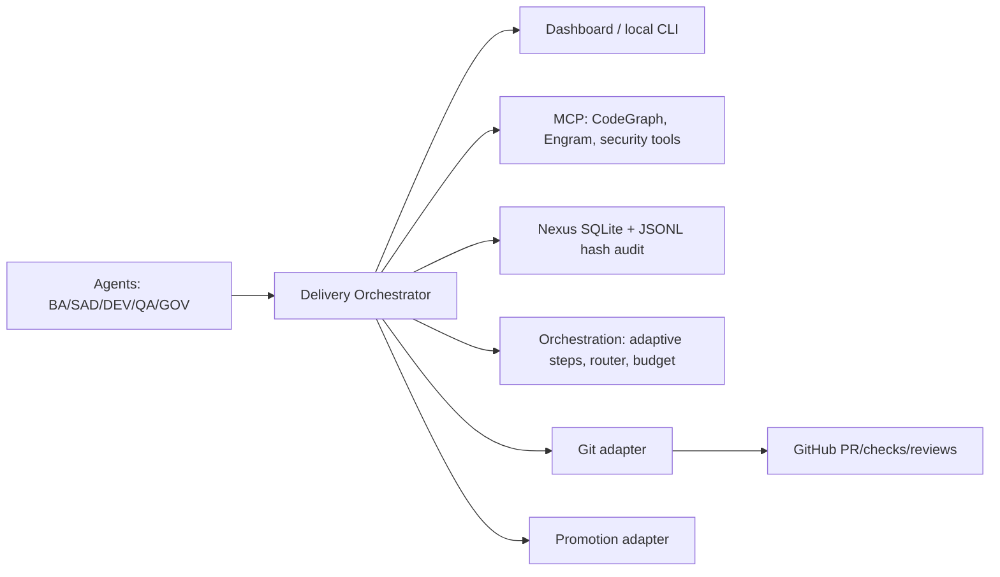
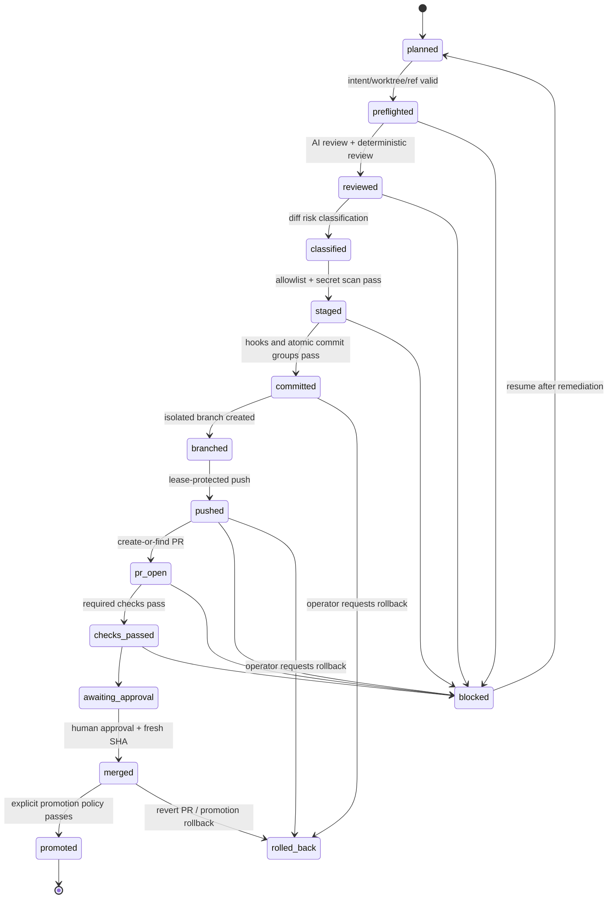

# ADR-0022: Automated Delivery Orchestrator (Local-First + GitHub)

## Status

Proposed

## Date

2026-08-30

## Context

Gentle-Vanguard needs one resumable command that can take an already implemented change through
local validation, AI review, safe staging, atomic commits, branch publication, pull request checks,
approval-gated merge, and promotion. The command must improve delivery throughput without becoming a
security bypass, exposing credentials to agents, or silently changing application/release
versioning.

The design must preserve the local-first operating model (ADR-0017), the five-layer topology, the
existing quality and publication gates, hash-chained audit, and the repository PR rules. GitHub is
an external control plane and therefore optional until the operator explicitly requests publication.

## Decision

Introduce a TypeScript delivery orchestrator, tentatively exposed as `delivery`, with a durable
state machine and provider-neutral ports. It runs locally by default, uses a temporary isolated
worktree for mutations, and calls GitHub only through a least-privilege adapter.

The orchestrator **never**:

- disables hooks, required checks, branch protection, secret scanners, or review requirements;
- uses `--no-verify`, force-push, admin/bypass merge, or credentials in prompts/logs/artifacts;
- changes `package.json` versions, changelogs, tags, release files, or lockfiles unless they were
  explicitly present in the operator's declared change set;
- merges without a human approval represented by GitHub's review API and a fresh head-SHA check;
- promotes an external deployment automatically from a local run.

### Five-layer placement



Agents provide review proposals and remediation suggestions; only the orchestrator's deterministic
policy engine may mutate Git or call a side-effecting provider. AI output is advisory until
converted to a typed, policy-checked action.

## CLI contract

Canonical command (implementation target):

```text
npm run delivery -- run --intent <file> [options]
npm run delivery -- resume <run-id> [--from <state>] [--dry-run]
npm run delivery -- status <run-id>
npm run delivery -- approve <run-id> --purpose merge|promotion
npm run delivery -- rollback <run-id> --scope local|branch|pr|promotion [--confirm]
```

Required `intent` fields: `summary`, `target` (`develop` or `main`), `changePaths`, `commitGroups`,
`branchName` (or a deterministic naming policy), `requestedBy`, and `promotion` (`none`, `local`, or
`external`). `changePaths` is an allowlist, not a hint. An absent allowlist causes a hard stop.

Important options:

| Option                        |    Default | Rule                                                                                 |
| ----------------------------- | ---------: | ------------------------------------------------------------------------------------ |
| `--dry-run`                   |      false | Plans and scans only; no file, GitHub, commit, push, merge, or promotion side effect |
| `--target`                    |     intent | Must match protected-branch policy                                                   |
| `--review`                    | `ai+human` | `ai` never satisfies the human approval gate                                         |
| `--max-tokens` / `--max-cost` |     config | Reserve budget before dispatch; hard limit stops new AI work                         |
| `--resume`                    |      false | Reuses checkpoint only after workspace/ref/hash validation                           |
| `--keep-worktree`             |      false | Keeps forensic worktree after stop; never deletes operator files                     |
| `--yes`                       |      false | May acknowledge non-risky confirmations only; cannot approve merge/promotion         |
| `--no-version-change`         |       true | Immutable safety invariant; no opt-out in this command                               |

Exit codes: `0` completed, `2` policy/user action required, `3` validation/check failure, `4` budget
exhausted, `5` provider/transient failure (safe to resume), `6` integrity or secret finding.

Proposed TypeScript contract:

```ts
type DeliveryState =
  | 'planned'
  | 'preflighted'
  | 'reviewed'
  | 'classified'
  | 'staged'
  | 'committed'
  | 'branched'
  | 'pushed'
  | 'pr_open'
  | 'checks_passed'
  | 'awaiting_approval'
  | 'merged'
  | 'promoted'
  | 'rolled_back'
  | 'blocked';

interface DeliveryIntent {
  runId?: string;
  summary: string;
  target: 'develop' | 'main';
  changePaths: string[];
  commitGroups: Array<{ scope: string; paths: string[]; message: string }>;
  branchName?: string;
  requestedBy: string;
  promotion: 'none' | 'local' | 'external';
}

interface DeliveryCheckpoint {
  runId: string;
  state: DeliveryState;
  stateVersion: number;
  intentHash: string;
  workspaceHash: string;
  targetSha: string;
  worktreePath: string;
  branch?: string;
  commitShas: string[];
  prNumber?: number;
  checkSnapshot?: Record<string, 'pending' | 'pass' | 'fail' | 'cancelled'>;
  budget: { reservedTokens: number; usedTokens: number; estimatedCost: number };
  updatedAt: string;
}
```

The runtime validates this contract with Zod before execution. All provider methods accept an
`idempotencyKey = runId + state + inputHash`; retries cannot create a second branch/PR or repeat a
merge.

## State machine and execution policy



### Stage rules

1. **Preflight**: verify repository identity, clean/known worktree, Git version, target remote SHA,
   branch protection visibility, tools, config schemas, disk space, and budget. Capture an initial
   hash; refuse TOCTOU if the source changes.
2. **Review IA**: send only a minimized diff/context (never `.env`, credentials, raw environment,
   tokens, or untracked sensitive files). Run lenses selected by diff class. AI findings are stored
   as redacted evidence and must cite paths/lines.
3. **Classification**: deterministic classifier labels `docs`, `test`, `code`, `config`, `workflow`,
   `security`, `dependency`, `schema`, or `release`. Highest-risk class wins. `security`, workflow,
   dependency, schema, and release changes require GOV/QA review and cannot auto-promote.
4. **Staging**: stage only the intent allowlist, after checking path traversal, symlinks, ignored
   files, generated artifacts, secrets, and version/release paths. Recompute diff hash and require
   exact match. Mixed or unexpected files block.
5. **Commits**: one commit per declared coherent group; run existing hooks normally. No automatic
   amend/rebase that changes approved content. A failed hook leaves the checkpoint before commit.
6. **Branch/push**: create from the recorded target SHA in the temporary worktree; use normal push
   and lease protection. Never force-push shared branches.
7. **PR/checks**: create-or-find by an immutable delivery marker containing `runId` and intent hash;
   poll only required checks from repository policy, with exponential backoff and webhook support
   later. New commits invalidate review/check snapshots and return to `pr_open`.
8. **Merge**: require required checks, no conflicts, branch up-to-date, approval by an authorized
   human, and unchanged head SHA. Use the repository's configured strategy; otherwise stop.
9. **Promotion**: local promotion may produce/verify an artifact and update local Nexus state.
   External promotion is an explicit second command/approval and requires deployment-specific gates.

## Diff classification and adaptive execution

The classifier combines path rules, Git metadata, dependency graph impact, test coverage, and prior
failure history. It selects the smallest sufficient lane:

| Class                   | Minimum lane                              | Additional gate                            |
| ----------------------- | ----------------------------------------- | ------------------------------------------ |
| docs/test               | format + focused tests                    | full CI remains authoritative              |
| code                    | lint + typecheck + focused tests          | QA review                                  |
| config/workflow         | schema + workflow/security lint           | GOV review; no auto-merge                  |
| dependency              | lockfile consistency + audit + full tests | dependency/security review                 |
| security/schema/release | full quality/security suite               | explicit human plan and promotion approval |

Adaptive retries are bounded (maximum two remediation rounds). Each round reuses failure evidence,
narrows context, and dispatches only the responsible agent. It never relaxes a gate. After the
bound, the state is `blocked` with the exact next human action.

## Durability, idempotency, and rollback

- **Checkpoint store**: `.session/delivery/<runId>/checkpoint.json` plus Nexus rows. Write-ahead
  event before each side effect; atomically replace checkpoint files and fsync where available.
- **Recovery**: `resume` verifies intent hash, repository identity, worktree path, target SHA,
  branch head, and every prior artifact hash. Mismatch creates a new run or blocks; it never
  guesses.
- **Nexus**: use existing `events`/audit infrastructure and add a delivery-specific projection only
  if query volume warrants it (`delivery_runs`, `delivery_checkpoints`, `delivery_artifacts`).
- **Rollback**: local changes are discarded by deleting the temporary worktree; pushed changes are
  reverted with a new auditable revert commit/PR; merged changes are never reset or force-pushed.
  Promotion rollback uses the previously verified artifact/version selected by a human. The command
  never invents or increments a version.

## Events and memory contracts

Every event is hash-chained and tenant-scoped:

```ts
interface DeliveryEvent {
  eventId: string;
  runId: string;
  tenantId: string;
  type: string;
  state: DeliveryState;
  actor: 'orchestrator' | 'agent' | 'human' | 'github';
  inputHash: string;
  artifactHashes: string[];
  payload: Record<string, unknown>;
  redactions: string[];
  prevHash: string | null;
  hash: string;
  occurredAt: string;
}
```

Event names include `delivery.started`, `preflight.completed`, `review.completed`,
`diff.classified`, `staging.blocked`, `commit.created`, `branch.created`, `push.completed`,
`pr.reconciled`, `checks.snapshot`, `approval.recorded`, `merge.completed`, `promotion.completed`,
`rollback.completed`, `delivery.blocked`, and `budget.exhausted`.

Nexus stores operational detail, hashes, statuses, cost/tokens, provider IDs, and redacted findings.
Engram stores only durable summaries: decision rationale, recurring failure pattern, and remediation
lesson keyed by repository/tenant. It must never store diffs containing secrets, tokens, raw
prompts, or full credentials. Dashboard views derive from Nexus; no mock delivery status is
permitted.

## GitHub permissions and trust boundary

Use a GitHub App installation token rather than a personal token. Minimum repository permissions:

| Permission      | Level      | Use                                                            |
| --------------- | ---------- | -------------------------------------------------------------- |
| Contents        | read/write | read refs; create branch and push delivery branch              |
| Pull requests   | read/write | create/update/read PR, request reviewers, merge after approval |
| Checks          | read       | read check runs/results                                        |
| Commit statuses | read       | read legacy statuses if required                               |
| Metadata        | read       | repository identity                                            |

`Actions: read` is optional only if workflow-run details are required. Issues, administration,
secrets, variables, deployments, releases, packages, members, and bypass permissions are not
granted. The local process receives the token through an environment/credential helper; it is never
passed to an agent, prompt, checkpoint, event payload, PR body, or log. GitHub branch rulesets
remain the final authority and GitHub Actions use their own narrowly scoped `GITHUB_TOKEN`.

## Manual by design

Human action remains mandatory for: intent approval for risky diffs; AI finding
acceptance/rejection; reviewer assignment where ownership is ambiguous; merge approval;
version/release/tag changes; production/external promotion; rollback selection; and any secret
incident response. The orchestrator may pause and explain, but cannot self-approve, self-bypass,
rotate credentials, or declare a false positive without evidence.

## Reducing iterations without reducing safety

1. Require a structured intent and commit plan before agents edit.
2. Run one preflight that caches tool/config/repository facts and shares a compact evidence bundle.
3. Classify once, then select focused tests; keep full CI as the immutable final gate.
4. Parallelize read-only AI lenses and independent tests; serialize Git mutations.
5. Include exact path/line evidence, failing command, likely owner, and next action in every
   finding.
6. Reuse checkpointed hashes and CI results only while the input/head SHA is unchanged.
7. Use deterministic PR markers and `runId` idempotency keys instead of searching by title.
8. Stop after two bounded remediation cycles and produce a handoff, rather than loop.

## Alternatives considered

| Option                                         | Decision   | Reason                                                                            |
| ---------------------------------------------- | ---------- | --------------------------------------------------------------------------------- |
| Local-only shell script                        | Rejected   | weak durability, poor typed policy and provider boundaries                        |
| GitHub Actions as controller                   | Rejected   | violates local-first default and expands credential blast radius                  |
| Agent-driven Git commands                      | Rejected   | nondeterministic side effects and unsafe secret/tool boundary                     |
| Existing orchestrator + typed delivery adapter | **Chosen** | reuses adaptive routing, budgets, Nexus, audit, and MCP while centralizing policy |

## Consequences

### Positive

- Repeatable delivery with safe retries, forensic audit, and resumability.
- Fewer context/review loops through classification, focused gates, and structured handoffs.
- GitHub integration without granting administrative or secret-management authority.
- Versioning and human governance remain explicit.

### Negative and mitigation

- More local state and implementation complexity: use a small state machine, schema validation, and
  checkpoint projection.
- A human can still block delivery: expose precise evidence and next actions; do not replace
  judgment with unsafe automation.
- External promotion remains operator-owned: keep it as a separate adapter and explicit approval.

## Related decisions

- ADR-0017 — Local-First Operating Model
- ADR-0005 — Homologation Gate
- ADR-0007 — Nexus Operational Database
- ADR-0014/0015 — SLSA provenance and signing
- `rules/PR-WORKFLOW.md`, `rules/SECRETS-MANAGEMENT.md`

**Review date**: Q4 2026 **Status**: Architecture proposal; implementation requires a follow-up
SDD/spec and security review.
