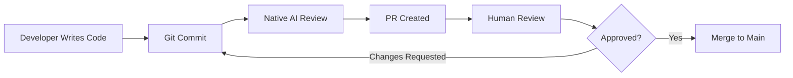

# Gentleman Foundation
## AI Concepts & Best Practices

**versión:** 1.0  
**Date:** April 2026  
**Audience:** Development Team  

---

## Table of Contents

1. [What is an LLM?](#1-what-is-an-llm)
2. [AI Agents & Tools](#2-ai-agents--tools)
3. [Prompt Engineering](#3-prompt-engineering)
4. [Best Practices](#4-best-practices)
5. [Security Considerations](#5-security-considerations)
6. [FAQ](#6-faq)
7. [Resources](#7-resources)

---

## 1. What is an LLM?

**LLM** = Large Language Model

```text
╔═══════════════════════════════════════════════════════════════════╗
║                          LLM (Large Language Model)              ║
╚═══════════════════════════════════════════════════════════════════╝

    Input:  "Write a function that adds two numbers"
             
             [Understands context]                                      
             [Generates response based on learned patterns]             
             
    Output: "function sum(a, b) { return a + b; }"
```

> **Note:** LLMs generate text based on patterns learned from massive datasets. They don't "understand" code like humans do, but they can generate syntactically correct code.

### Key Concepts

| Concept | Description |
|---------|-------------|
| **Context Window** | How much text the model can "see" at once |
| **Tokens** | Text chunks (roughly 4 characters = 1 token) |
| **Temperature** | How random/creative the output is (0=deterministic, 1=creative) |
| **System Prompt** | Instructions that define the AI's behavior |

---

## 2. AI Agents & Tools

### What is an AI Agent?

An AI agent is a system that:
1. Receives a task
2. Plans steps to complete it
3. Uses tools (code execution, file access, etc.)
4. Iterates based on results

### Foundation AI Stack

| Component | Purpose |
|-----------|---------|
| **OpenCode** | AI agent for development tasks |
| **Engram** | Persistent memory across sessions |
| **Native Review Engine** | Code review with AI |
| **Foundation Skills** | Context and patterns for AI |

### Tool Categories

**🛠️ AI Development Tools Landscape**

| Category | Tools | Purpose |
|----------|-------|---------|
| **Code Generation** | OpenCode, GitHub Copilot, Cursor | Generate and complete code |
| **Code Review** | Native Review Engine, Human review | Validate and improve code |
| **Memory & Context** | Engram, Foundation Skills | Persistent context across sessions |
| **Execution** | Code interpreter, Terminal access | Run and test code |

---

## 3. Prompt Engineering

### Basic Principles

1. **Be Specific** - Clear requests get better results
2. **Provide Context** - Show relevant code or files
3. **Define Constraints** - Specify language, style, limits
4. **Iterate** - Refine based on output

### Examples

|  Bad Prompt | [OK] Good Prompt |
|--------------|----------------|
| "Fix my code" | "Fix the null pointer exception on line 45 in auth.go" |
| "Write tests" | "Write unit tests for the validateEmail function in utils/validation.go" |
| "Improve this" | "Refactor this function to be more readable, max 20 lines" |

### Chain of Thought

```
Ask: "What steps should I take to implement user authentication?"

Response:
1. Define data model (User struct)
2. Create database migration
3. Implement registration endpoint
4. Implement login endpoint
5. Add JWT tokens
6. Write tests
```

---

## 4. Best Practices

### 4.1 When to Use AI

| Good Use Cases | Avoid Using AI For |
|----------------|-------------------|
| Code generation | Critical security code |
| Boilerplate | Complex business logic |
| Documentation | Sensitive data handling |
| Refactoring | Performance-critical code |
| Testing | Architecture decisións |
| Learning new tech | Understanding legacy systems |

### 4.2 Code Review Workflow

**🔍 Recommended Code Review Process**



**Key Points:**

- **Native AI Review** runs automatically via pre-commit hooks
- **Human Review** is mandatory for critical changes
- **Iterate** quickly when changes are requested

---

### 4.3 AI-Assisted Development Cycle

**🔄 Recommended Development Cycle**

| Step | Phase | Description | Tools |
|------|-------|-------------|-------|
| 1 | **Plan** | Define task and constraints | Skills, Engram |
| 2 | **Generate** | AI generates initial code | OpenCode, Copilot |
| 3 | **Review** | Native review + human review | Native Review Engine |
| 4 | **Iterate** | Refine based on feedback | Edit, Test cycles |
| 5 | **Test** | Verify functionality | Test runners, Manual |

### 4.4 Quality Guidelines

- **Verify AI-generated code** - Always review before committing
- **Test thoroughly** - AI can miss edge cases
- **Document decisións** - Not all AI output is optimal
- **Keep context** - Use skills and engram for continuity

---

## 5. Security Considerations

### Do

- Use AI for learning and exploration
- Review code for logic errors
- Use native pre-commit security scanning
- Keep prompts focused and specific

### Don't

- Send secrets or credentials in prompts
- Trust AI-generated code blindly
- Share sensitive business logic
- Skip human review on critical changes

### Security Scanning

```powershell
# Run security check before commit
.\.githooks\pre-commit.ps1

# Manual security scan
.\scripts\utilities\wf.ps1 review security
```

---

## 6. FAQ

### Q: Can I trust AI-generated code?

**A:** Partially. AI can generate syntactically correct code that is logically wrong. Always:
- Review the generated code
- Test thoroughly
- Have someone else review critical changes

### Q: How do I get better results from AI?

**A:** 
1. Provide more context (relevant files, existing patterns)
2. Break complex tasks into smaller steps
3. Iterate and refine your prompts
4. Use foundation skills for project-specific context

### Q: What if AI suggests something wrong?

**A:** 
1. Question the suggestión
2. Verify against documentation
3. Test the proposed solution
4. Trust your expertise when in doubt

### Q: How do I measure AI effectiveness?

**A:** The audit system tracks:
- Lines of code generated vs written
- Review cycles
- Time saved
- Quality metrics

---

## 7. Resources

### Foundation Documentation

- [ARCHITECTURE.md](../reference/ARCHITECTURE.md) - System design
- [AI-CONFIGURATION.md](../guides/AI-CONFIGURATION.md) - AI setup
- [SKILL_INDEX.md](../../skills/SKILL_INDEX.md) - Available skills

### External Resources

| Resource | URL |
|----------|-----|
| OpenCode | https://opencode.ai |
| Anthropic Claude | https://anthropic.com |
| Prompt Engineering Guide | https://promptengineering.org |

### Skills for AI Development

| Skill | When to Use |
|-------|-------------|
| `ai-sdk-5-skill` | Building AI integrations |
| `mcp-skill` | Model Context Protocol |
| `security-skill` | Security best practices |

---

**Last Updated:** April 2026
**Next Review:** Quarterly
