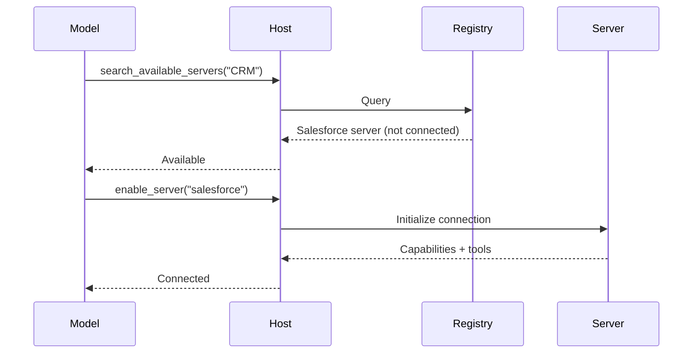

# MCP Server Development: Production Best Practices

> Research-based analysis covering testing, health checks, error handling, monitoring, deployment, security, and auto-registration for production-grade MCP servers.

---

## 1. Testing

### Source: Official MCP SDKs & FastMCP

The official SDKs provide several testing patterns:

#### InMemoryTransport (TypeScript SDK)
The preferred approach for unit/integration tests. It creates linked transport pairs without subprocess or network:

```typescript
import { InMemoryTransport } from '@modelcontextprotocol/sdk/inMemory.js';

const [clientTransport, serverTransport] = InMemoryTransport.createLinkedPair();
await Promise.all([
  client.connect(clientTransport),
  mcpServer.server.connect(serverTransport),
]);
```

Used extensively in `test/server/mcp.test.ts` for testing tools, resources, prompts, progress notifications, and logging.

#### Stdio Transport Testing
- **TS SDK**: Uses `Readable`/`Writable` streams with `ReadBuffer` for capturing output. Tests confirm clean start/close, message ordering, and no reads before `start()`.
- **Python SDK**: Uses `io.StringIO`/`io.BytesIO` with `anyio.AsyncFile` wrappers to simulate stdio. Tests verify message round-trips.

#### SSE Security Testing (Python SDK)
- Tests DNS rebinding protection via `TransportSecuritySettings` and `Origin` header validation
- Uses `uvicorn` + `Starlette` with multiprocessing to spin up test servers
- Fixtures for `server_port`/`server_url` with socket binding

#### Exception Handling Tests (Python SDK)
```python
# Tests confirm:
# - raise_exceptions=True re-raises transport exceptions
# - raise_exceptions=False logs locally (per TS/Go/C# SDK convention)
# - Normal message handling unaffected by exception paths
@pytest.mark.anyio
async def test_exception_handling_with_raise_exceptions_true():
    server = Server("test-server")
    session = Mock(spec=ServerSession)
    with pytest.raises(RuntimeError, match="Test error"):
        await server._handle_message(test_exception, session, {}, raise_exceptions=True)
```

#### FastMCP Testing
Tests use `FastMCP` + `Client` with InMemoryTransports. Schema validation tests ensure tool params generate correct JSON Schema from Python type annotations.

### Recommendations
- Always use `InMemoryTransport` for unit tests — avoids process/network overhead
- Test full lifecycle: initialize → capability negotiation → tool call → shutdown
- Test error paths: invalid params, unknown tools, network disconnects, timeout
- Test both `isError: true` tool results and protocol-level JSON-RPC errors
- Use vitest (TS) or pytest + anyio (Python) as test framework

---

## 2. Health Checks

### Source: MCP Specification — Ping

The MCP spec defines a **built-in ping mechanism** via the `ping` request:

```json
{
  "jsonrpc": "2.0",
  "id": "123",
  "method": "ping"
}
// Response:
{ "jsonrpc": "2.0", "id": "123", "result": {} }
```

### Spec Requirements
- Receiver **MUST** respond promptly with empty response
- If no response within timeout, sender **MAY**: consider connection stale, terminate, attempt reconnection
- Implementations **SHOULD** periodically issue pings to detect health
- Frequency **SHOULD** be configurable
- Timeouts **SHOULD** be environment-appropriate
- Excessive pinging **SHOULD** be avoided
- Timeouts **SHOULD** be treated as connection failures
- Multiple failed pings **MAY** trigger connection reset
- Failures **SHOULD** be logged for diagnostics

### Application-Level Health
Beyond the protocol ping:

| Layer | Mechanism | Purpose |
|-------|-----------|---------|
| Protocol | `ping` request | Connection liveness |
| Transport | TCP keepalive / HTTP keepalive | Network-level health |
| Application | Tool-specific heartbeat | Dependency health (DB, API) |
| Readiness | `/health` HTTP endpoint | Load balancer / orchestrator |

For Streamable HTTP servers, expose a health endpoint (e.g., `GET /health`) that:
- Returns `200 OK` when server is operational
- Checks connectivity to critical dependencies (DB, upstream APIs)
- Includes version info and uptime

### Recommendations
- Configure ping interval (e.g., 30s) with a timeout (e.g., 10s)
- On 3 consecutive failures, close transport and attempt reconnect
- For HTTP servers, provide a `/health` endpoint separate from the MCP endpoint
- Log ping failures with correlation IDs for debugging

---

## 3. Error Handling & Resilience

### Source: MCP Spec — Tools, Lifecycle, Logging; Debugging Guide

### Two Error Levels

**Protocol Errors** (JSON-RPC):
| Code | Meaning |
|------|---------|
| `-32700` | Parse error |
| `-32600` | Invalid request |
| `-32601` | Method not found |
| `-32602` | Invalid params (e.g., unknown tool, bad protocol version) |
| `-32603` | Internal error |

**Tool Execution Errors** (application-level):
```json
{
  "jsonrpc": "2.0", 
  "id": 4,
  "result": {
    "content": [{ "type": "text", "text": "Invalid date: must be in future" }],
    "isError": true
  }
}
```
- `isError: true` signals errors the LLM can **self-correct** and retry
- Protocol errors are structural — LLM is less likely to fix these
- Clients **SHOULD** provide tool execution errors to the LLM for self-correction

### Lifecycle Error Handling
- Protocol version mismatch: `-32602` with supported versions in data
- Capability negotiation failure: disconnect with error
- Request timeouts: issue `notifications/cancellation`, stop waiting
- Progress notifications **MAY** reset timeout clock, but max timeout **SHOULD** always be enforced

### Resilience Patterns
1. **Timeouts**: Per-request configurable timeouts; cancel on timeout
2. **Reconnection**: On stale connection, attempt reconnect with exponential backoff
3. **Graceful Shutdown** (stdio): Close stdin → wait → SIGTERM → SIGKILL
4. **Graceful Shutdown** (HTTP): Close connection(s), terminate session
5. **Session Expiry** (Streamable HTTP): Server may terminate session, client re-initializes

### FastMCP Approach
FastMCP handles schema generation, validation, and protocol lifecycle automatically. Error boundaries are built into the framework. Python functions throw exceptions → framework converts to `isError: true` responses.

### Recommendations
- Use `isError: true` for business logic errors, JSON-RPC errors for infrastructure failure
- Always provide actionable error messages that help the LLM self-correct
- Implement configurable per-request timeouts
- Graceful shutdown with clear sequence (close input → wait → terminate)
- For connection loss, attempt reconnection with backoff

---

## 4. Monitoring & Observability

### Source: MCP Spec — Logging; Debugging Guide

### Structured Logging Protocol

MCP defines 8 RFC 5424 severity levels sent via `notifications/message`:

| Level | Use Case |
|-------|----------|
| `debug` | Function entry/exit, detailed trace |
| `info` | Operation progress, general events |
| `notice` | Configuration changes, significant events |
| `warning` | Deprecated feature usage, approaching limits |
| `error` | Operation failures |
| `critical` | System component failures |
| `alert` | Data corruption, immediate action needed |
| `emergency` | Complete system failure |

**Log Message Format:**
```json
{
  "jsonrpc": "2.0",
  "method": "notifications/message",
  "params": {
    "level": "error",
    "logger": "database",
    "data": { "error": "Connection failed", "details": { "host": "localhost" } }
  }
}
```

Clients control verbosity via `logging/setLevel`. Servers that emit logs **MUST** declare `logging` capability.

### Server-Side Logging (stdout/stderr)
- **stdio servers**: Log to stderr (captured by host). NEVER write to stdout.
- **HTTP servers**: Log via `notifications/message` or standard HTTP logging (curl, DevTools).
- All transports: Use consistent logger names, include context, add timestamps, track request IDs.

### MCP Inspector
The primary interactive debugging tool:
- `npx @modelcontextprotocol/inspector <command>` — connects to any server
- Inspect tools, resources, prompts via Web UI
- Monitor notification stream (logs, list_changed, etc.)
- Test edge cases: invalid inputs, missing args, concurrent operations

### Client-Side Debugging (Claude Desktop)
- Logs at `~/Library/Logs/Claude/mcp*.log` (macOS) or `%APPDATA%\Claude\logs` (Windows)
- Chrome DevTools via `developer_settings.json { "allowDevTools": true }`
- Network panel for request/response inspection

### Recommendations
- Always declare `logging` capability
- Log at `info` for normal operations, `error` for failures, `debug` for troubleshooting
- Rate-limit log messages to avoid flooding
- Never include credentials, PII, or internal system details in logs
- Use the MCP Inspector during development as your primary test tool
- Monitor log volume as a health signal (sudden spikes = problem)

---

## 5. Deployment / CI/CD

### Source: MCP Docs, SDKs, Community Patterns

### Transport-Specific Deployment

**Stdio (local):**
- Client launches server as subprocess
- Server executable installed locally or via npx/uvx
- Configuration in client's config file (e.g., `claude_desktop_config.json`)
- Always use **absolute paths** in configurations
- Environment variables: client passes a limited set; add via `env` key in config

```json
{
  "mcpServers": {
    "myserver": {
      "command": "node",
      "args": ["path/to/server.js"],
      "env": { "API_KEY": "..." }
    }
  }
}
```

**Streamable HTTP (remote):**
- Server runs as independent HTTP service
- Multiple clients can connect
- Session management via `MCP-Session-Id` header
- `Origin` header validation required for security
- `MCP-Protocol-Version` header must be set on all requests

### MCP Registry Deployment
The official MCP Registry supports:
- **Package types**: npm, PyPI, GitHub Releases
- **Automation**: GitHub Actions for publishing
- **Versioning**: Semantic versioning required
- **Authentication**: OAuth 2.0 for publishing
- **Moderation**: Registry moderation policy applies

### CI/CD Pipeline Considerations
- Run `InMemoryTransport`-based unit tests
- Use MCP Inspector for integration testing in CI
- Version your server's protocol capability appropriately
- Publish to npm/PyPI for easy `npx`/`uvx` consumption
- For remote servers: standard HTTP deployment practices (reverse proxy, TLS, scaling)

### Recommendations
- Ship both stdio and HTTP transports when possible
- Always use absolute paths in config docs/examples
- Provide `env` documentation for all configurable variables
- Test with MCP Inspector in CI before release
- Publish to npm/PyPI for `npx`/`uvx` discoverability
- For HTTP servers: TLS, rate limiting, auth, and Origin validation are mandatory

---

## 6. Security

### Source: MCP Security Best Practices, Transports, Tools

### Confused Deputy (OAuth Proxy)
- **Risk**: Malicious client obtains auth codes by exploiting consent cookies + static client IDs
- **Mitigation**: Per-client consent storage, consent UI before third-party auth, strict redirect_uri validation, OAuth state parameter with single-use + expiry

### Token Passthrough
- **Risk**: Client passes tokens directly to downstream API, bypassing server controls
- **Mitigation**: MCP servers **MUST NOT** accept tokens not explicitly issued for the server. Always validate token audience/claims.

### SSRF (Server-Side Request Forgery)
- **Risk**: Malicious server sends client to internal resources (cloud metadata, localhost services)
- **Mitigation**: Enforce HTTPS, block private IP ranges, validate redirect targets, use egress proxies (Smokescreen), DNS pinning

### Session Hijacking
- **Risk**: Attacker obtains session ID and impersonates client
- **Mitigation**: Non-deterministic session IDs (secure random/UUID), bind sessions to user info (`<user_id>:<session_id>`), verify all inbound requests, never use sessions for auth

### Local Server Compromise
- **Risk**: Malicious server binary or startup command
- **Mitigation**: Pre-configuration consent dialog (show exact command), sandboxing, restricted privileges, platform-appropriate isolation

### Scope Minimization
- **Risk**: Broad access token leaks enable lateral movement
- **Mitigation**: Progressive least-privilege scopes, incremental elevation, avoid wildcard scopes

### Transport Security (Streamable HTTP)
- **Origin header validation** — servers **MUST** validate `Origin`, reject invalid with `403`
- **Localhost binding** — servers **SHOULD** bind only to `127.0.0.1` when running locally
- **Authentication required** — servers **SHOULD** implement auth for all connections

### Tool-Level Security
- Servers **MUST**: validate all inputs, implement access controls, rate limit invocations, sanitize outputs
- Clients **SHOULD**: prompt for user confirmation on sensitive ops, show tool inputs before calling, validate results before LLM, log tool usage

### Recommendations
- Implement all transport security measures (Origin validation, localhost binding, auth)
- Never passthrough tokens — validate every token's audience
- Use per-client consent with strict redirect_uri matching
- Rate-limit tool invocations per client
- Log all tool usage for audit trails
- Follow input sanitization and output validation for every tool

---

## 7. Auto-Registration / Discovery

### Source: Client Best Practices, MCP Spec

### Progressive Discovery (Client-Side)
For hosts with many servers/tools, naive `tools/list` → inject every definition wastes context. Three-layer approach:

1. **Catalog layer**: Lightweight `search_tools` meta-tool returns names + one-line descriptions
2. **Inspect layer**: `get_tool_details(name)` returns full schema for ONE tool
3. **Execute layer**: Model calls the tool with full knowledge

Strategies: keyword (BM25/regex), embedding (vector similarity), subagent (small model), hybrid, or provider-native tool search.

### Dynamic Server Management
Hosts can lazily connect/disconnect servers:
1. Registry of available servers with descriptions
2. Connect only when model determines need
3. Disconnect when task complete → free context



### MCP Registry (Server-Side)
The **official MCP Registry** provides:
- Package hosting (npm, PyPI, GitHub Releases)
- Search and discovery for users
- GitHub Actions automation for publishing
- Versioning (semver)
- Moderation policy

### Server-Initiated Discovery Signals
- `notifications/tools/list_changed` — notify clients when available tools change
- `notifications/resources/list_changed` — notify when resources change
- `notifications/prompts/list_changed` — notify when prompts change
- These require declaring `listChanged: true` in capabilities

### Recommendations
- Implement `listChanged` notifications so clients know when capabilities change
- For multi-server environments, leverage client-side progressive discovery (search + inspect + execute pattern)
- Publish to MCP Registry for discoverability
- Use `outputSchema` on tools to enable typed programmatic calling
- Consider the client's prompt caching strategy when designing tool refresh patterns

---

## Summary: Production Readiness Checklist

| Area | Must Have | Nice to Have |
|------|-----------|--------------|
| **Testing** | InMemoryTransport unit tests | SSE/HTTP integration tests, conformance tests |
| **Health** | Ping handler (built-in) | Dedicated HTTP health endpoint, dependency checks |
| **Error Handling** | `isError: true` for business logic, configurable timeouts | Graceful shutdown, reconnection with backoff |
| **Monitoring** | `logging` capability, structured log messages (8 levels) | Log aggregation, rate monitoring, MCP Inspector in CI |
| **Deployment** | Absolute paths, `env` documentation, transport security | Registry publishing, GitHub Actions automation |
| **Security** | Origin validation, no token passthrough, input validation, rate limiting | Per-client consent, sandboxing, audit logging |
| **Discovery** | `listChanged` notifications, clear tool/resource/prompt naming | Registry listing, `outputSchema`, progressive discovery |
