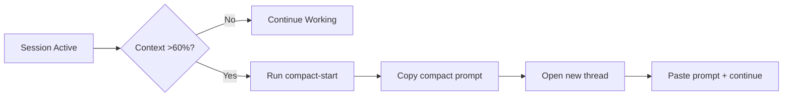

# Session Handoff Protocol

## Standard Flow



## Steps

### 1. Pre-Handoff
```powershell
# Save session state
.\wf.ps1 end-session

# Generate context pack
.\wf.ps1 context-pack "objective"

# Generate compact prompt
.\wf.ps1 compact-start "objective"
```

### 2. Start New Session
```powershell
# From new thread: paste compact prompt
# Then run:
.\wf.ps1 start-session
```

### 3. Intra-Session Context Pack
```powershell
# Mid-session snapshot
.\wf.ps1 context-pack "current objective"
```

## Marker Protocol

The `.session/.compact-marker` file prevents duplicate compact-start runs:

```
1. User runs "wf compact-start" → writes marker + timestamp
2. Auto-trigger fires (LiveAssist) → checks marker → skips if <60min
3. User runs "wf start-session" → start-session.ps1 checks marker → skips if <60min
```

**Result**: compact-start runs at most once per 60 min regardless of trigger source.
