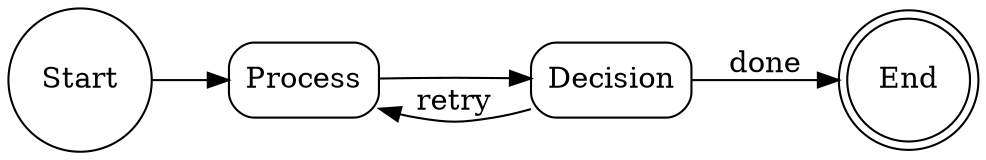
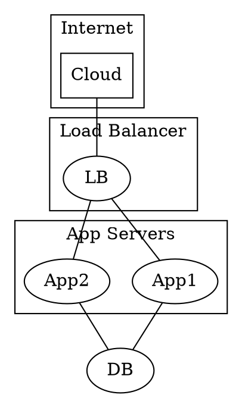
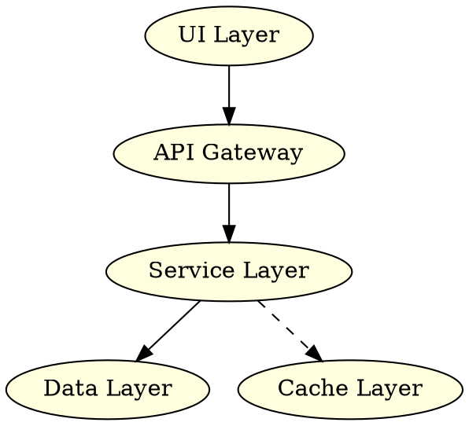
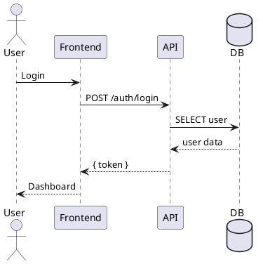
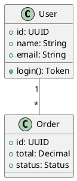

## When to Use

- Generating architecture diagrams from DOT descriptions
- Rendering PlantUML sequence/class/activity diagrams
- Creating network topology maps, org charts, decision trees
- Batch diagram generation for documentation
- When Mermaid syntax is insufficient for complex diagrams

## Architecture

```
Input (.dot / .puml / .wsd)
  ↓
diagram-renderer.ts
  ├── Graphviz (.dot → SVG) — viz.js/wasm or local graphviz
  ├── PlantUML (.puml → SVG) — plantuml.jar or online renderer
  └── Fallback: Mermaid-compatible output
        ↓
  Output: SVG / PNG / Markdown embed
```

## Usage

```bash
# Render Graphviz DOT to SVG
npx tsx src/cli/diagram-renderer.ts input.dot --output diagram.svg

# Render PlantUML to PNG
npx tsx src/cli/diagram-renderer.ts diagram.puml --format png --output diagram.png

# Render inline DOT string (no file needed)
npx tsx src/cli/diagram-renderer.ts --dot "digraph G { A -> B; B -> C; }" --output graph.svg

# Batch render all .dot files in a directory
npx tsx src/cli/diagram-renderer.ts docs/diagrams/ --output-dir docs/generated/

# Watch mode — auto-render on file change
npx tsx src/cli/diagram-renderer.ts diagrams/ --watch --output-dir docs/generated/

# Generate architecture diagram from codegraph index
npx tsx src/cli/diagram-renderer.ts --from-codegraph --module src/core --depth 2 --output architecture.svg
```

## Supported Formats

| Input    | Output          | Engine       |
|----------|-----------------|--------------|
| `.dot`   | SVG, PNG        | Graphviz     |
| `.gv`    | SVG, PNG        | Graphviz     |
| `.puml`  | SVG, PNG        | PlantUML     |
| `.wsd`   | SVG, PNG        | PlantUML     |
| `--dot`  | SVG, PNG        | Graphviz     |
| `--from-codegraph` | SVG | CodeGraph AST |

## Graphviz Examples

### Flowchart


### Network Topology


### Architecture Layer


## PlantUML Examples

### Sequence Diagram


### Class Diagram


## CodeGraph Integration

Generate architecture diagrams from real code structure:

```bash
# Dependency graph for a module
npx tsx src/cli/diagram-renderer.ts --from-codegraph --module src/core --depth 2 --output deps.svg

# Full system architecture
npx tsx src/cli/diagram-renderer.ts --from-codegraph --all-modules --output system-arch.svg

# Filter by file pattern
npx tsx src/cli/diagram-renderer.ts --from-codegraph --include "**/*controller*" --output controllers.svg
```

## Configuration

Create `config/diagram-renderer.json`:

```json
{
  "defaultEngine": "graphviz",
  "graphviz": {
    "layout": "dot",
    "dpi": 96,
    "defaultNodeStyle": "box, rounded, style=solid"
  },
  "plantuml": {
    "theme": "plain",
    "defaultSkin": "mono"
  },
  "codegraph": {
    "maxDepth": 3,
    "excludePatterns": ["node_modules", "dist", ".git"]
  },
  "outputDir": "docs/diagrams/generated/"
}
```

## Error Handling

- Graphviz not installed → HTML+JavaScript fallback (via viz.js CDN)
- PlantUML jar not found → online renderer fallback (plantuml.com/plantuml/svg/)
- Syntax errors → clear error message with line number
- Batch mode → continue on error, report summary at end
