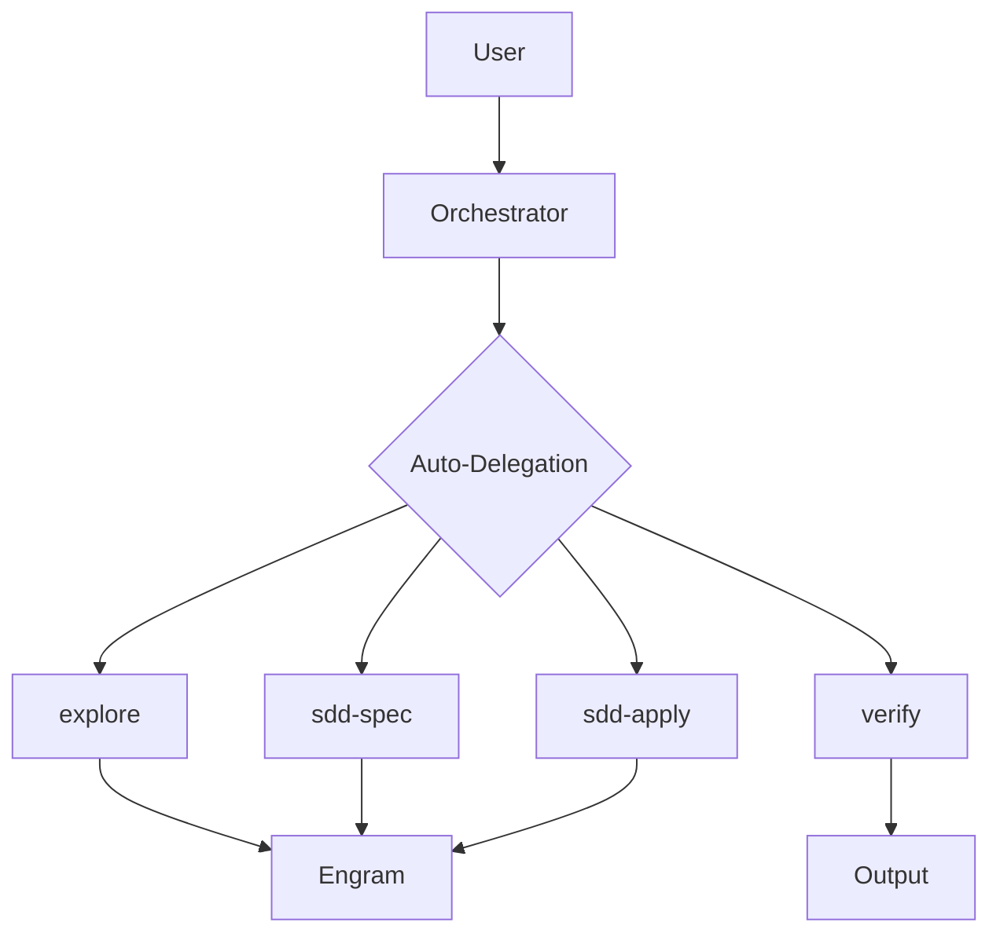
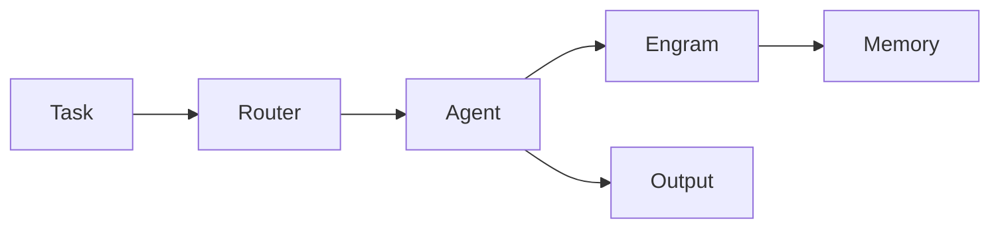

# Visual Content Skill

## Purpose

Create visual content to complement text in content-output-skill.
For social media, presentations, and documentation.

## Content Types

| Type | Format | Use |
|------|--------|-----|
| ASCII Art | Text | Logos, banners |
| Mermaid | .mmd | Architecture diagrams |
| Presentation | MD/PowerPoint | Talks, demos |
| Social Cards | 1200x630px | Twitter, LinkedIn |

---

## ASCII Art

### Foundation Logo (Classic)
```
 ▄▄▄▄▄▄▄▄▄▄▄▄▄▄▄▄▄▄▄▄▄▄▄▄▄▄▄▄
 █                             █
 █   █████╗  ██████╗  ██████╗ ███████╗
 █  ██╔══██╗██╔═══██╗██╔═══██╗██╔══██╗
 █  ██████║██║   ██║██║   ██║██║  ██║
 █  ██╔═══██╗██║   ██║██║   ██║██║  ██║
 █  ██║  ██║╚██████╔╝╚██████╔╝███████║
 █  ╚═╝  ╚═╝ ╚═════╝  ╚═════╝ ╚══════╝
 █       FOUNDATION        █
  ▀▀▀▀▀▀▀▀▀▀▀▀▀▀▀▀▀▀▀▀▀▀▀▀▀▀▀▀
```

### Foundation Logo (Modern)
```
╔══════════════════════════════════════════╗
║                                          ║
║     ●█╗   ●█╗ █████╗  ●██████╗  ██████╗ ║
║     ██╗  ██║██╔══██╗ ██╔════╝ ██╔══██╗║
║     ███████║███████║ ██║  ███╗███████║║
║     ██╔══██║██╔══██║ ██║   ██║██╔══██║║
║     ██║  ██║██║  ██║ ╚██████╔╝███████║║
║     ╚═╝  ╚═╝╚═╝  ╚═╝  ╚═════╝ ╚══════╝║
║          F O U N D A T I O N           ║
║                                          ║
╚══════════════════════════════════════════╝
```

### Foundation Logo (Minimal)
```
┌─────────────────────────────┐
│  █████╗  ██████╗  ██████╗  │
│  ██╔══██╗██╔═══██╗██╔═══██╗ │
│  ██████║██║   ██║██║   ██║ │
│  ██╔═══██╗██║   ██║██║   ██║ │
│  ██║  ██║╚██████╔╝╚██████╔╝ │
│  ╚═╝  ╚═╝ ╚═════╝  ╚═════╝  │
│       FOUNDATION            │
└─────────────────────────────┘
```

### Pillars (7D)
```
═══════════════════════════════════
  🛡️ SECURITY    │  🔍 QUALITY    │
  📐 ARCH        │  🧪 TESTING   │
  📡 API         │  📖 DOCS      │
  🔀 GITFLOW    │                  
═══════════════════════════════════
```

### Features Icons
```
  🤖 AI Orchestration     🧠 Memory
  ⚡ Auto-Delegation      ⚖️ Judgment
  📊 Reporting          📋 SDD
  🛡️ 7D Validation     🔄 On-Demand
```

### Mini Banner
```
🏛️ Foundation v2.0 - AI Development Stack
=====================================
```
 ▄▄▄▄▄▄▄▄▄▄▄▄▄▄▄▄▄▄▄▄▄▄▄▄▄▄▄▄
 █                             █
 █   █████╗  ██████╗  ██████╗ ███████╗
 █  ██╔══██╗██╔═══██╗██╔═══██╗██╔══██╗
 █  ██████║██║   ██║██║   ██║██║  ██║
 █  ██╔═══██╗██║   ██║██║   ██║██║  ██║
 █  ██║  ██║╚██████╔╝╚██████╔╝███████║
 █  ╚═╝  ╚═╝ ╚═════╝  ╚═════╝ ╚══════╝
 █       FOUNDATION        █
  ▀▀▀▀▀▀▀▀▀▀▀▀▀▀▀▀▀▀▀▀▀▀▀▀▀▀▀▀
```

### Mini Banner
```
🏛️ Foundation v2.0 - AI Development Stack
=====================================
```

---

## Mermaid Diagrams

### Architecture Overview


### Workflow


---

## Social Media Cards

---

## External Resources (For Professional Logos)

For production logos and social media assets, use these tools:

| Tool | Purpose | Link |
|------|---------|------|
| **Canva** | Logo + posts | canva.com |
| **Figma** | Design | figma.com (free) |
| **Midjourney** | AI art | discord.gg/midjourney |
| **Bing Creator** | AI images | bing.com/create |
| **LogoAI** | AI logo generator | logoai.com |

### AI Image Generation Prompts

Use these prompts in Midjourney, DALL-E, Bing Image Creator, or Canva:

---

#### Foundation Logo (Square - 1080x1080)
```
Foundation logo, dark blue background #0d1117, cyan and purple neon accents,
modern tech aesthetic, minimalist geometric style, "FOUNDATION" text in bold,
digital transformation, AI development, holographic effect, sleek, professional
```

#### Twitter/X Banner (1600x900)
```
Tech banner for Twitter, Foundation AI Development Stack, dark theme #0d1117,
cyan glow accents, code symbols floating, data streams, modern clean design,
professional tech aesthetic, 16:9 ratio, no text
```

#### LinkedIn Banner (1584x396)
```
Professional LinkedIn banner, Foundation development stack, corporate blue #0d1117,
geometric lines, network nodes connected, subtle AI brain pattern, elegant,
business professional, clean minimalist, no text
```

#### Feature Cards (1200x630)
```
Social media card: Auto-delegation feature, cyan accent on dark background,
minimal icon of robot brain, modern tech style, professional, clean,
"Auto-Delegation" text overlay, square ratio
```

#### Feature Cards - Memory (1200x630)
```
Social media card: Persistent Memory feature, purple accent on dark,
brain with database icon, modern tech, professional, "Engram Memory" text
```

#### Feature Cards - Validation (1200x630)
```
Social media card: 7D Validation concept, multi-layer shield, 7 glowing dots,
dark blue background, cyan and purple, modern, "7D Validation" text
```

#### Feature Cards - Judgment (1200x630)
```
Social media card: Judgment Day protocol, two scales balancing, judge gavel,
dark dramatic background, purple highlight, professional, "Judgment Day" text
```

#### Announcement Post (1200x1200)
```
Square post: Foundation v2.0 release announcement, bold typography, neon glow,
celebration particles, AI and tech theme, professional, "v2.0" prominent, 
dark blue background
```

---

### Platform-Specific Image Specs

| Platform | Dimensions | Aspect Ratio |
|----------|------------|-------------|
| Twitter/X Post | 1200x675 | 16:9 |
| LinkedIn Post | 1200x627 | 1.91:1 |
| Instagram Post | 1080x1080 | 1:1 |
| Discord Embed | 800x400 | 2:1 |
| WhatsApp | 800x800 | 1:1 |

---

### Midjourney Quick Commands

```
/imagine: Foundation logo --ar 1:1 --v 6
/imagine: Twitter banner --ar 16:9 --v 6  
/imagine: Feature card --ar 3:2 --v 6
```

### Bing Image Creator

1. Go to bing.com/create
2. Paste any prompt above
3. Download and use

---

### Canva Template Prompts

"Create a social media post with:
- Dark background (#0d1117)
- Cyan accent (#00d4ff) 
- Text: [YOUR TEXT]
- Modern tech style
- Clean minimalist design"

---

*Skill version: 1.2*  
*Last updated: 2026-04-27*