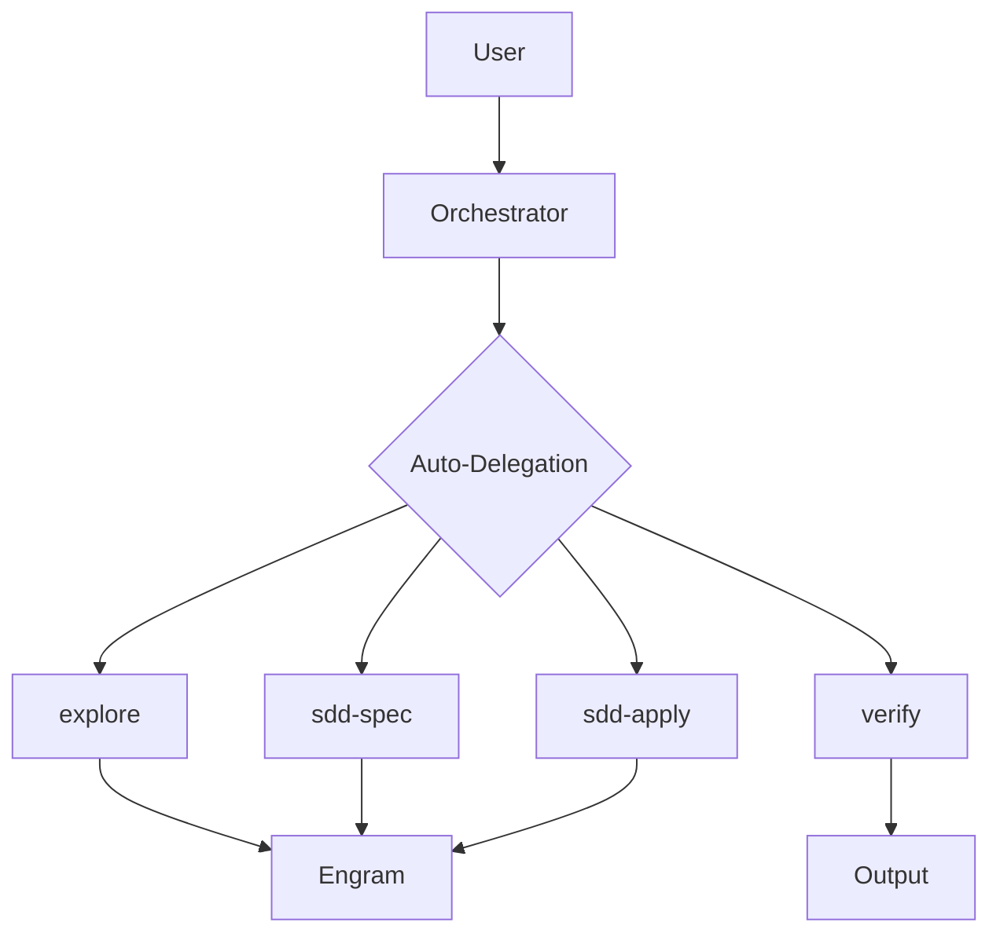
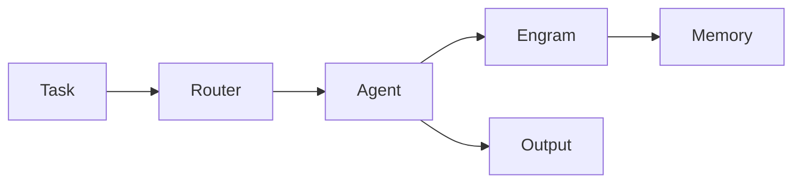

# Visual Content Skill

## Purpose

Create visual content to complement text in content-output-skill.
For social media, presentations, and documentation.

## Content Types

| Type | Format | Use |
|------|--------|-----|
| ASCII Art | Text | Logos, banners |
| Mermaid | .mmd | Architecture diagrams |
| Presentation | MD/PowerPoint | Talks, demos |
| Social Cards | 1200x630px | Twitter, LinkedIn |

---

## ASCII Art

### Foundation Logo (Classic)
```
 ▄▄▄▄▄▄▄▄▄▄▄▄▄▄▄▄▄▄▄▄▄▄▄▄▄▄▄▄
 █                             █
 █   █████╗  ██████╗  ██████╗ ███████╗
 █  ██╔══██╗██╔═══██╗██╔═══██╗██╔══██╗
 █  ██████║██║   ██║██║   ██║██║  ██║
 █  ██╔═══██╗██║   ██║██║   ██║██║  ██║
 █  ██║  ██║╚██████╔╝╚██████╔╝███████║
 █  ╚═╝  ╚═╝ ╚═════╝  ╚═════╝ ╚══════╝
 █       FOUNDATION        █
  ▀▀▀▀▀▀▀▀▀▀▀▀▀▀▀▀▀▀▀▀▀▀▀▀▀▀▀▀
```

### Foundation Logo (Modern)
```
╔══════════════════════════════════════════╗
║                                          ║
║     ●█╗   ●█╗ █████╗  ●██████╗  ██████╗ ║
║     ██╗  ██║██╔══██╗ ██╔════╝ ██╔══██╗║
║     ███████║███████║ ██║  ███╗███████║║
║     ██╔══██║██╔══██║ ██║   ██║██╔══██║║
║     ██║  ██║██║  ██║ ╚██████╔╝███████║║
║     ╚═╝  ╚═╝╚═╝  ╚═╝  ╚═════╝ ╚══════╝║
║          F O U N D A T I O N           ║
║                                          ║
╚══════════════════════════════════════════╝
```

### Foundation Logo (Minimal)
```
┌─────────────────────────────┐
│  █████╗  ██████╗  ██████╗  │
│  ██╔══██╗██╔═══██╗██╔═══██╗ │
│  ██████║██║   ██║██║   ██║ │
│  ██╔═══██╗██║   ██║██║   ██║ │
│  ██║  ██║╚██████╔╝╚██████╔╝ │
│  ╚═╝  ╚═╝ ╚═════╝  ╚═════╝  │
│       FOUNDATION            │
└─────────────────────────────┘
```

### Pillars (7D)
```
═══════════════════════════════════
  🛡️ SECURITY    │  🔍 QUALITY    │
  📐 ARCH        │  🧪 TESTING   │
  📡 API         │  📖 DOCS      │
  🔀 GITFLOW    │                  
═══════════════════════════════════
```

### Features Icons
```
  🤖 AI Orchestration     🧠 Memory
  ⚡ Auto-Delegation      ⚖️ Judgment
  📊 Reporting          📋 SDD
  🛡️ 7D Validation     🔄 On-Demand
```

### Mini Banner
```
🏛️ Foundation v2.0 - AI Development Stack
=====================================
```
 ▄▄▄▄▄▄▄▄▄▄▄▄▄▄▄▄▄▄▄▄▄▄▄▄▄▄▄▄
 █                             █
 █   █████╗  ██████╗  ██████╗ ███████╗
 █  ██╔══██╗██╔═══██╗██╔═══██╗██╔══██╗
 █  ██████║██║   ██║██║   ██║██║  ██║
 █  ██╔═══██╗██║   ██║██║   ██║██║  ██║
 █  ██║  ██║╚██████╔╝╚██████╔╝███████║
 █  ╚═╝  ╚═╝ ╚═════╝  ╚═════╝ ╚══════╝
 █       FOUNDATION        █
  ▀▀▀▀▀▀▀▀▀▀▀▀▀▀▀▀▀▀▀▀▀▀▀▀▀▀▀▀
```

### Mini Banner
```
🏛️ Foundation v2.0 - AI Development Stack
=====================================
```

---

## Mermaid Diagrams

### Architecture Overview


### Workflow


---

## Social Media Cards

---

## External Resources (For Professional Logos)

For production logos and social media assets, use these tools:

| Tool | Purpose | Link |
|------|---------|------|
| **Canva** | Logo + posts | canva.com |
| **Figma** | Design | figma.com (free) |
| **Midjourney** | AI art | discord.gg/midjourney |
| **Bing Creator** | AI images | bing.com/create |
| **LogoAI** | AI logo generator | logoai.com |

### Recommended Workflow

1. Generate basic concept in ASCII here
2. Export to Figma/Canva for professional version
3. Create variants for each platform

---

*Skill version: 1.1*  
*Last updated: 2026-04-27*