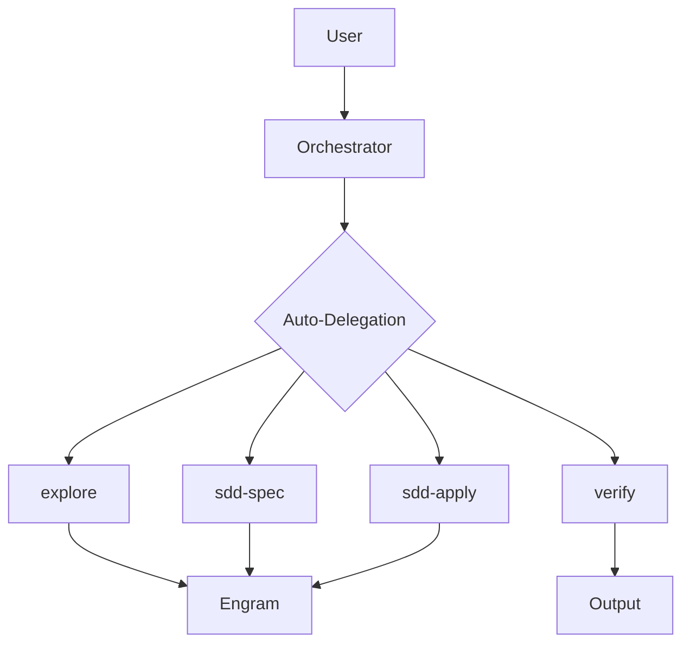
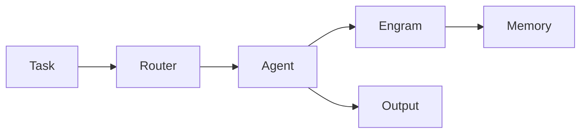

# Visual Content Skill

## Purpose

Create visual content to complement text in content-output-skill.
For social media, presentations, and documentation.

## Content Types

| Type | Format | Use |
|------|--------|-----|
| ASCII Art | Text | Logos, banners |
| Mermaid | .mmd | Architecture diagrams |
| Presentation | MD/PowerPoint | Talks, demos |
| Social Cards | 1200x630px | Twitter, LinkedIn |

---

## ASCII Art

### Foundation Logo
```
 ▄▄▄▄▄▄▄▄▄▄▄▄▄▄▄▄▄▄▄▄▄▄▄▄▄▄▄▄
 █                             █
 █   █████╗  ██████╗  ██████╗ ███████╗
 █  ██╔══██╗██╔═══██╗██╔═══██╗██╔══██╗
 █  ██████║██║   ██║██║   ██║██║  ██║
 █  ██╔═══██╗██║   ██║██║   ██║██║  ██║
 █  ██║  ██║╚██████╔╝╚██████╔╝███████║
 █  ╚═╝  ╚═╝ ╚═════╝  ╚═════╝ ╚══════╝
 █       FOUNDATION        █
  ▀▀▀▀▀▀▀▀▀▀▀▀▀▀▀▀▀▀▀▀▀▀▀▀▀▀▀▀
```

### Mini Banner
```
🏛️ Foundation v2.0 - AI Development Stack
=====================================
```

---

## Mermaid Diagrams

### Architecture Overview


### Workflow


---

## Social Media Cards

### Twitter/X (1200x675)
```
┌─────────────────────────────────────────┐
│                                 //
│        🏛️ Foundation            //
│   AI Development Stack            //
//                                 //
│  • Auto-delegation              //
//  • Persistent memory          //
│  • 7D Validation            //
//                                 │
//        github.com/...          //
└─────────────────────────────────────────┘
```

---

## Presentation Templates

### Quick Slide (16:9)
```
# Title

## Subtitle

### Bullet 1
### Bullet 2
### Bullet 3

---

## CTA
Link or next steps
```

---

## Usage

```powershell
# Use with content-output-skill for complete campaigns
# visual-content provides graphics
# content-output provides text
```

---

## Integration

- Use with `content-output-skill` for full campaigns
- ASCII art: Copy-paste directly
- Mermaid: Render with mermaid-cli or VSCode extension

---

*Skill version: 1.0*  
*Last updated: 2026-04-27*